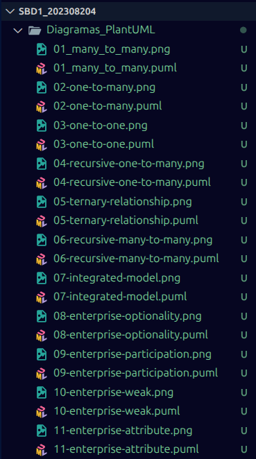
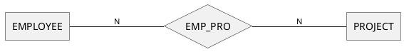
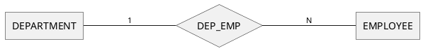
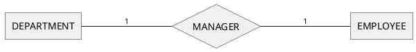
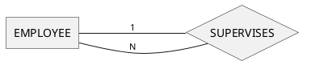
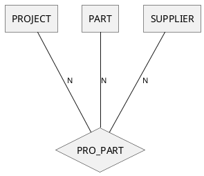
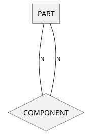
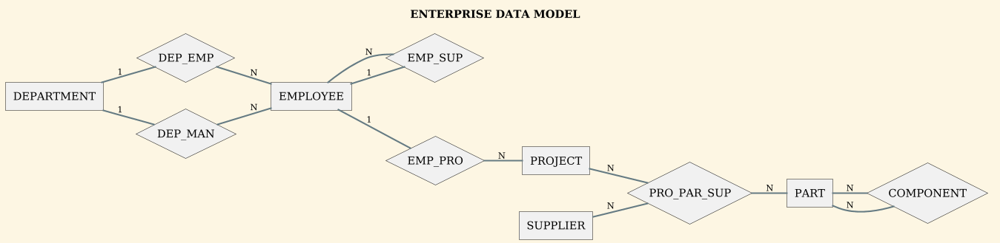
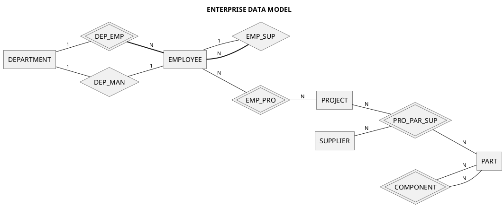
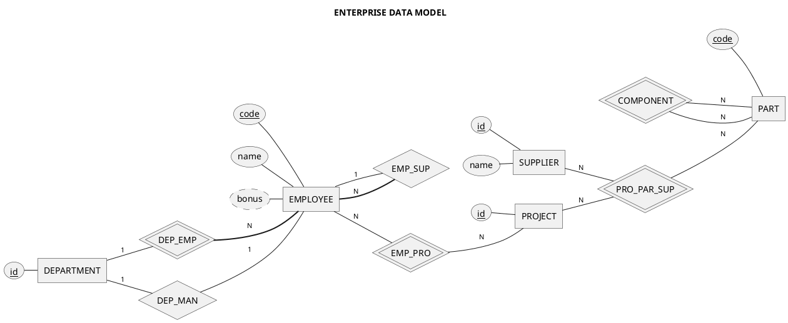

# Tarea: Diagramas Chen con PlantUML

**Curso:** Sistemas de Bases de Datos 1  
**Fecha:** 5 de marzo de 2026  
**Nombre:** Ebed Isai Patzan Tzic
**Carne:** 202308204
---

## Evidencia de la realizacion de los ejercicios



## Ejercicio 1 — Many to Many

### Código

```text
@startchen 01_many_to_many
left to right direction

entity EMPLOYEE {
}

entity PROJECT {
}

relationship EMP_PRO {
}

EMPLOYEE -N- EMP_PRO
EMP_PRO -N- PROJECT

@endchen
```

### Diagrama



---

## Ejercicio 2 — One to Many

### Código

```text
@startchen 02-one-to-many
left to right direction

entity DEPARTMENT {
}

entity EMPLOYEE {
}

relationship DEP_EMP {
}

DEPARTMENT -1- DEP_EMP
DEP_EMP -N- EMPLOYEE

@endchen
```

### Diagrama



---

## Ejercicio 3 — One to One

### Código

```text
@startchen 03-one-to-one
left to right direction

entity DEPARTMENT {
}

entity EMPLOYEE {
}

relationship MANAGER {
}

DEPARTMENT -1- MANAGER
MANAGER -1- EMPLOYEE

@endchen
```

### Diagrama



---

## Ejercicio 4 — Recursive One to Many

### Código

```text
@startchen 04-recursive-one-to-many
left to right direction

entity EMPLOYEE {
}

relationship SUPERVISES {
}

EMPLOYEE -1- SUPERVISES
SUPERVISES -N- EMPLOYEE

@endchen
```

### Diagrama



---

## Ejercicio 5 — Ternary Relationship

### Código

```text
@startchen 05-ternary-relationship

entity PROJECT {
}

entity PART {
}

entity SUPPLIER {
}

relationship PRO_PART {
}

PROJECT -N- PRO_PART
PART -N- PRO_PART
SUPPLIER -N- PRO_PART

@endchen
```

### Diagrama



---

## Ejercicio 6 — Recursive Many to Many

### Código

```text
@startchen 06-recursive-many-to-many

entity PART {
}

relationship COMPONENT {
}

PART -N- COMPONENT
COMPONENT -N- PART

@endchen
```

### Diagrama



---

## Ejercicio 7 — Integrated Model

### Código

```text
@startchen 07-integrated-model
title ENTERPRISE DATA MODEL
left to right direction
skinparam ranksep 10
!theme sunlust

entity DEPARTMENT {
}
entity EMPLOYEE {
}
entity PROJECT {
}
entity PART {
}
entity SUPPLIER {
}

relationship DEP_EMP {
}
relationship DEP_MAN {
}
relationship EMP_SUP {
}
relationship EMP_PRO {
}
relationship PRO_PAR_SUP {
}
relationship COMPONENT {
}

DEPARTMENT -1- DEP_EMP
DEP_EMP -N- EMPLOYEE

DEPARTMENT -1- DEP_MAN
DEP_MAN -N- EMPLOYEE

EMPLOYEE -1- EMP_SUP
EMP_SUP -N- EMPLOYEE

EMPLOYEE -1- EMP_PRO
EMP_PRO -N- PROJECT

PROJECT -N- PRO_PAR_SUP
PRO_PAR_SUP -N- PART
SUPPLIER -N- PRO_PAR_SUP

PART -N- COMPONENT
COMPONENT -N- PART

@endchen
```

### Diagrama



---

## Ejercicio 8 — Enterprise Optionality

### Código

```text
@startchen 08-enterprise-optionality
title ENTERPRISE DATA MODEL
left to right direction
skinparam ranksep 20

entity DEPARTMENT {
}
entity EMPLOYEE {
}
entity PROJECT {
}
entity PART {
}
entity SUPPLIER {
}

relationship DEP_EMP {
}
relationship DEP_MAN {
}
relationship EMP_SUP {
}
relationship EMP_PRO {
}
relationship PRO_PAR_SUP {
}
relationship COMPONENT {
}

DEPARTMENT -(0,1)- DEP_EMP
DEP_EMP -(1,N)- EMPLOYEE

DEPARTMENT -(0,1)- DEP_MAN
DEP_MAN -(0,1)- EMPLOYEE

EMPLOYEE -(0,1)- EMP_SUP
EMPLOYEE -(1,N)- EMP_SUP

EMPLOYEE -(0,N)- EMP_PRO
EMP_PRO -(0,N)- PROJECT

PROJECT -(0,N)- PRO_PAR_SUP
PRO_PAR_SUP -(0,N)- PART
SUPPLIER -(0,N)- PRO_PAR_SUP

COMPONENT -(1,N)- PART
COMPONENT -(1,N)- PART

@endchen
```

### Diagrama


---

## Ejercicio 9 — Enterprise Participation

### Código

```text
@startchen 09-enterprise-participation
title ENTERPRISE DATA MODEL
left to right direction
skinparam ranksep 20

entity DEPARTMENT {
}
entity EMPLOYEE {
}
entity PROJECT {
}
entity PART {
}
entity SUPPLIER {
}

relationship DEP_EMP {
}
relationship DEP_MAN {
}
relationship EMP_SUP {
}
relationship EMP_PRO {
}
relationship PRO_PAR_SUP {
}
relationship COMPONENT {
}

DEPARTMENT -1- DEP_EMP
DEP_EMP =N= EMPLOYEE

DEPARTMENT -1- DEP_MAN
DEP_MAN -1- EMPLOYEE

EMPLOYEE -1- EMP_SUP
EMPLOYEE =N= EMP_SUP

EMPLOYEE -N- EMP_PRO
EMP_PRO -N- PROJECT

PROJECT -N- PRO_PAR_SUP
PRO_PAR_SUP -N- PART
SUPPLIER -N- PRO_PAR_SUP

COMPONENT -N- PART
COMPONENT -N- PART

@endchen
```

### Diagrama


---

## Ejercicio 10 — Enterprise Weak

### Código

```text
@startchen 10-enterprise-weak
title ENTERPRISE DATA MODEL
left to right direction
skinparam ranksep 20

entity DEPARTMENT {
}
entity EMPLOYEE {
}
entity PROJECT {
}
entity PART {
}
entity SUPPLIER {
}

relationship DEP_EMP <<identifying>> {
}
relationship DEP_MAN {
}
relationship EMP_SUP {
}
relationship EMP_PRO <<identifying>> {
}
relationship PRO_PAR_SUP <<identifying>> {
}
relationship COMPONENT <<identifying>> {
}

DEPARTMENT -1- DEP_EMP
DEP_EMP =N= EMPLOYEE

DEPARTMENT -1- DEP_MAN
DEP_MAN -1- EMPLOYEE

EMPLOYEE -1- EMP_SUP
EMPLOYEE =N= EMP_SUP

EMPLOYEE -N- EMP_PRO
EMP_PRO -N- PROJECT

PROJECT -N- PRO_PAR_SUP
PRO_PAR_SUP -N- PART
SUPPLIER -N- PRO_PAR_SUP

COMPONENT -N- PART
COMPONENT -N- PART

@endchen
```

### Diagrama



---

## Ejercicio 11 — Enterprise Attribute

### Código

```text
@startchen 11-enterprise-attribute
title ENTERPRISE DATA MODEL
left to right direction
skinparam ranksep 20

entity DEPARTMENT {
    id <<key>>
}
entity EMPLOYEE {
    code <<key>>
    name <<multy>>
    bonus <<derived>>
}
entity PROJECT {
    id <<key>>
}
entity PART {
    code <<key>>
}
entity SUPPLIER {
    id <<key>>
    name
}

relationship DEP_EMP <<identifying>> {
}
relationship DEP_MAN {
}
relationship EMP_SUP {
}
relationship EMP_PRO <<identifying>> {
}
relationship PRO_PAR_SUP <<identifying>> {
}
relationship COMPONENT <<identifying>> {
}

DEPARTMENT -1- DEP_EMP
DEP_EMP =N= EMPLOYEE

DEPARTMENT -1- DEP_MAN
DEP_MAN -1- EMPLOYEE

EMPLOYEE -1- EMP_SUP
EMPLOYEE =N= EMP_SUP

EMPLOYEE -N- EMP_PRO
EMP_PRO -N- PROJECT

PROJECT -N- PRO_PAR_SUP
PRO_PAR_SUP -N- PART
SUPPLIER -N- PRO_PAR_SUP

COMPONENT -N- PART
COMPONENT -N- PART

@endchen
```

### Diagrama



---
