# 🚗 Sistema de Centros de Evaluación de Manejo

**Curso:** Sistemas de Bases de Datos 1 — USAC 1S 2026  
**Carnet:** `202308204`  
**Nombre:** `[TU NOMBRE COMPLETO AQUÍ]`  
**Ponderación:** 35.72 pts  
**Tiempo Estimado:** 48 hrs/min

---

## 📋 Descripción del Proyecto

Sistema de gestión para los Centros de Evaluación de Manejo de Guatemala. Expone una API REST construida con Node.js/Express sobre una base de datos Oracle XE, todo contenerizado con Docker para garantizar portabilidad y reproducibilidad.

### Tecnologías utilizadas

| Tecnología | Versión | Propósito |
|------------|---------|-----------|
| Docker Desktop | 24+ | Contenerización |
| Oracle XE | 21.3.0 | Motor de base de datos |
| Node.js | 20 LTS | Entorno de ejecución backend |
| Express | 4.x | Framework API REST |
| oracledb | 6.x | Driver de conexión a Oracle |
| DBeaver | Community | Administración visual de BD |
| Postman | Latest | Pruebas de endpoints |

---

## ✅ Pre-requisitos

Antes de levantar el sistema, asegúrate de tener instalado:

- [Docker Desktop](https://www.docker.com/products/docker-desktop/) (activo y corriendo)
- [Node.js LTS](https://nodejs.org/) v20+
- [Git](https://git-scm.com/)

---

## 🚀 Guía de Despliegue con Docker

### Paso 1 — Clonar el repositorio

```bash
git clone https://github.com/TU_USUARIO/SBD1B_1S2026_TUCARNET.git
cd SBD1B_1S2026_TUCARNET
```

### Paso 2 — Configurar variables de entorno

Copia el archivo de ejemplo y edítalo con tus credenciales:

```bash
cp .env.example .env
```

Abre `.env` y establece:
```env
ORACLE_PWD=Proyecto123
DB_USER=EVALUACION
DB_PASSWORD=Proyecto123
DB_CONNECT_STRING=localhost:1521/XEPDB1
PORT=3000
```

✅ **Nota:** El usuario `EVALUACION` es un usuario local del PDB (sin prefijo `c##`), lo que garantiza compatibilidad total con las referencias en los scripts SQL.

> ⚠️ La contraseña de Oracle debe tener al menos 8 caracteres, una mayúscula, una minúscula y un número.

### Paso 3 — Levantar Oracle XE con Docker

```bash
docker compose up -d
```

Este comando descarga la imagen de Oracle XE (≈2 GB la primera vez) y levanta el contenedor. Los scripts `01_ddl.sql` y `02_dml.sql` se ejecutan automáticamente al iniciar.

**Ver el progreso:**
```bash
docker logs -f oracle-xe-evaluacion
```

Espera hasta ver el mensaje:
```
DATABASE IS READY TO USE!
```

> ⏱️ El primer inicio puede tardar entre 3 y 8 minutos.

---

### 📸 Captura 1 — Docker Desktop mostrando contenedor activo


**Estado esperado:** El contenedor `oracle-xe-evaluacion` debe estar en estado `Running` (Verde).

---

### Paso 4 — Instalar dependencias Node.js

```bash
npm install
```

### Paso 5 — Iniciar la API

```bash
# Producción
npm start

# Desarrollo (reinicia automáticamente al guardar)
npm run dev
```

La API estará disponible en: `http://localhost:3000`

### Paso 6 — Verificar que todo funciona

```bash
curl http://localhost:3000/
```

Respuesta esperada:
```json
{
  "message": "API Centros de Evaluación de Manejo",
  "version": "1.0.0",
  "curso": "SBD1 USAC 2026"
}
```

---

### Paso 2 — Verificar estructura de datos

#### Paso 2.1 — Crear conexión en DBeaver

1. Abre DBeaver Community
2. Menú **Database** → **New Database Connection**
3. Selecciona **Oracle** → click **Next**

### Paso 2 — Configurar parámetros de conexión

| Campo | Valor |
|-------|-------|
| Connection Type | Basic |
| Host | localhost |
| Port | 1521 |
| Database (Service Name) | XEPDB1 |
| Username | EVALUACION |
| Password | Proyecto123 |
| **Driver** | **Oracle** (thin o thick) |

4. Click en **Test Connection**

---

### 📸 Captura 2 — DBeaver: pantalla de configuración de conexión

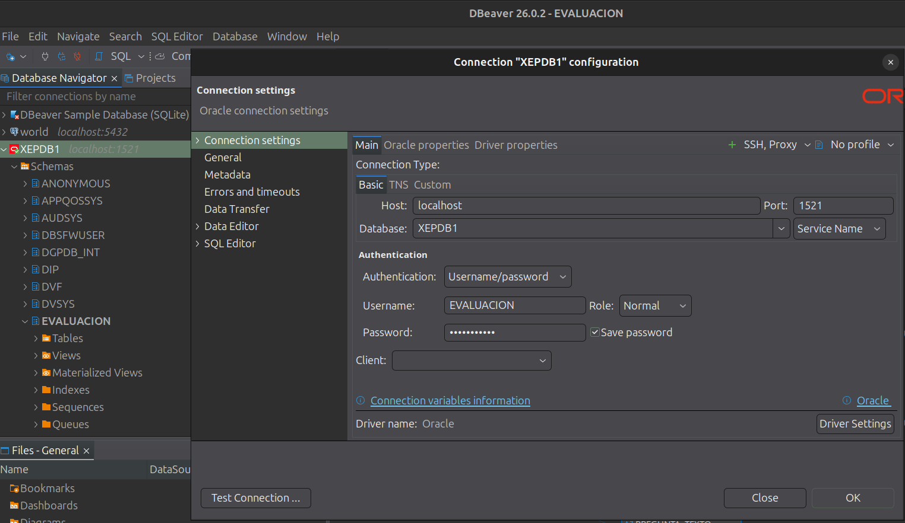

**Verificar:** Los parámetros deben coincidir exactamente con la tabla anterior.

---

5. Debe aparecer el mensaje **"Connected"** ✅
6. Click en **Finish**

### Paso 3 — Explorar las tablas

En el panel izquierdo (Database Navigator) de DBeaver:
```
XEPDB1 (conectado como EVALUACION)
  └── Schemas
      └── EVALUACION
          └── Tables (12 tablas)
              ├── DEPARTAMENTO
              ├── MUNICIPIO
              ├── CENTRO
              ├── ESCUELA
              ├── UBICACION
              ├── REGISTRO
              ├── CORRELATIVO
              ├── EXAMEN
              ├── PREGUNTAS
              ├── PREGUNTAS_PRACTICO
              ├── RESPUESTA_USUARIO
              └── RESPUESTA_PRACTICO_USUARIO
```

---

### 📸 Captura 3 — DBeaver: Datos en tabla DEPARTAMENTO

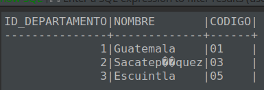

**Verificar:** Deben aparecer los 3 departamentos: Guatemala, Sacatepéquez, Escuintla.

---

### 📸 Captura 4 — DBeaver: Datos en tabla REGISTRO

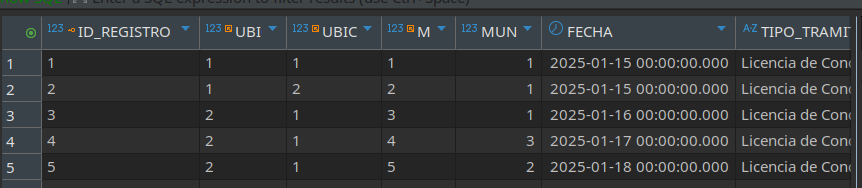

**Verificar:** Deben aparecer los registros de personas evaluadas.

---

### 📸 Captura 5 — DBeaver: Datos en tabla EXAMEN

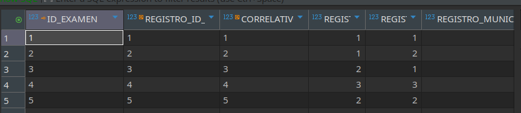

**Verificar:** Deben aparecer los exámenes creados con sus respectivos puntajes.

---

## 🌐 Descripción de Endpoints

### Base URL: `http://localhost:3000`

### Endpoints CRUD

Para cada entidad, se exponen los siguientes métodos:

| Método | Ruta | Descripción |
|--------|------|-------------|
| GET | `/api/{entidad}` | Listar todos los registros |
| GET | `/api/{entidad}/:id` | Obtener registro por ID |
| POST | `/api/{entidad}` | Crear nuevo registro |
| PUT | `/api/{entidad}/:id` | Actualizar registro existente |
| DELETE | `/api/{entidad}/:id` | Eliminar registro |

**Entidades disponibles:**

| Entidad | Ruta |
|---------|------|
| Departamento | `/api/departamentos` |
| Municipio | `/api/municipios` |
| Centro | `/api/centros` |
| Escuela | `/api/escuelas` |
| Ubicacion | `/api/ubicaciones` |
| Registro | `/api/registros` |
| Correlativo | `/api/correlativos` |
| Examen | `/api/examenes` |
| Preguntas | `/api/preguntas` |
| Preguntas Práctico | `/api/preguntas-practico` |
| Respuesta Usuario | `/api/respuestas-usuario` |
| Respuesta Práctico | `/api/respuestas-practico` |

### Endpoints Estadísticos

| Método | Ruta | Descripción |
|--------|------|-------------|
| GET | `/api/estadisticas/por-centro` | Estadísticas por centro y escuela |
| GET | `/api/estadisticas/ranking` | Ranking de evaluados |
| GET | `/api/estadisticas/pregunta-menor-aciertos` | Pregunta con menor % de aciertos |

---

---

## 📊 Estado del Proyecto

### ✅ Completado
- **Oracle XE 21.3.0** corriendo en contenedor Docker
- **12 Tablas** creadas automáticamente con DDL
- **Datos de prueba** insertados en todas las tablas (DML)
- **Usuario local** `EVALUACION` creado en PDB `XEPDB1`
- **Conexión verificada** desde DBeaver
- **Permisos** correctamente configurados

### ⏳ Próximos pasos
1. Instalar dependencias Node.js: `npm install`
2. Crear rutas CRUD para las 12 entidades
3. Implementar 3 endpoints de estadísticas SQL
4. Probar en Postman
5. Documentar capturas de evidence

---

## 🧪 Evidencia de Pruebas en Postman

### Prueba 1 — GET todos los departamentos

**Request:** `GET http://localhost:3000/api/departamentos`

---

### 📸 Captura 6 — Postman: GET /api/departamentos (200 OK)

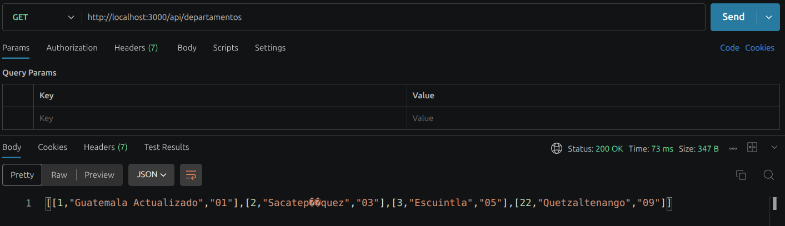

**Respuesta esperada:** Array JSON con los 3 departamentos.

---

### Prueba 2 — GET un departamento específico (ID=1)

**Request:** `GET http://localhost:3000/api/departamentos/1`

---

### 📸 Captura 7 — Postman: GET /api/departamentos/:id (200 OK)

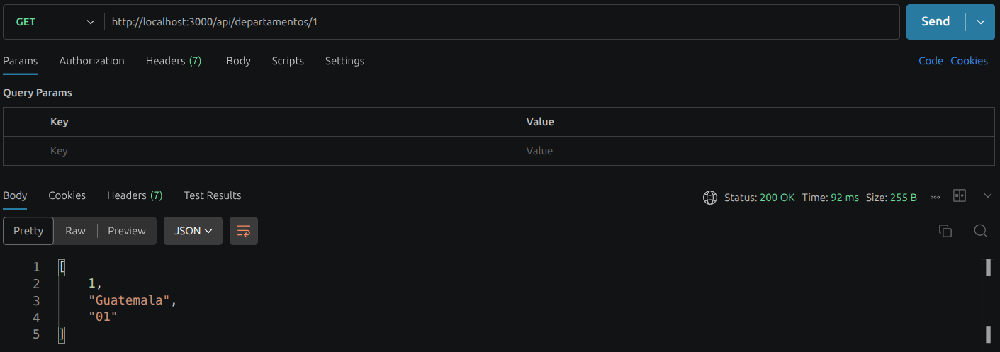

---

### Prueba 3 — POST crear departamento

**Request:** `POST http://localhost:3000/api/departamentos`

**Body:**
```json
{
  "nombre": "Quetzaltenango",
  "codigo": "09"
}
```

---

### 📸 Captura 8 — Postman: POST /api/departamentos (201 Created)

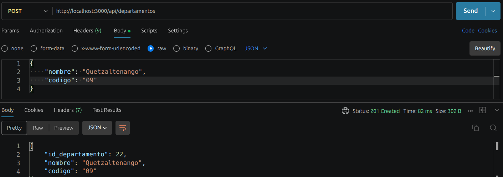

---

### Prueba 4 — PUT actualizar departamento

**Request:** `PUT http://localhost:3000/api/departamentos/1`

**Body:**
```json
{
  "nombre": "Guatemala Actualizado",
  "codigo": "01"
}
```

---

### 📸 Captura 9 — Postman: PUT /api/departamentos/:id (200 OK)

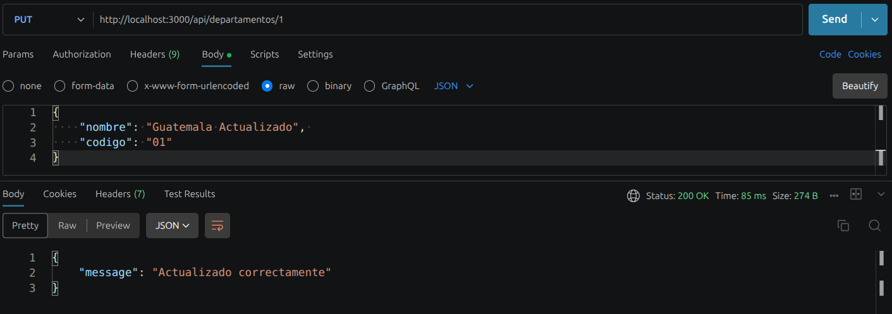

---

### Prueba 5 — DELETE eliminar departamento

**Request:** `DELETE http://localhost:3000/api/departamentos/22`

---

### 📸 Captura 10 — Postman: DELETE /api/departamentos/:id (200 OK)

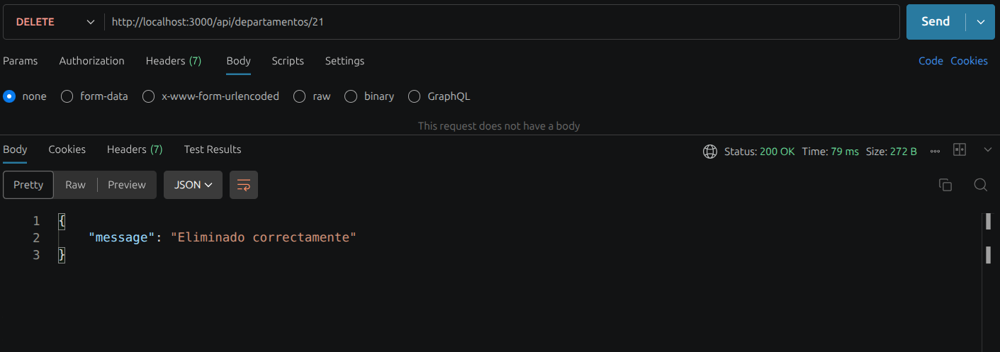

---

### Prueba 6 — Consulta 1: Estadísticas por Centro

**Request:** `GET http://localhost:3000/api/estadisticas/por-centro`

---

### 📸 Captura 11 — Postman: GET /api/estadisticas/por-centro

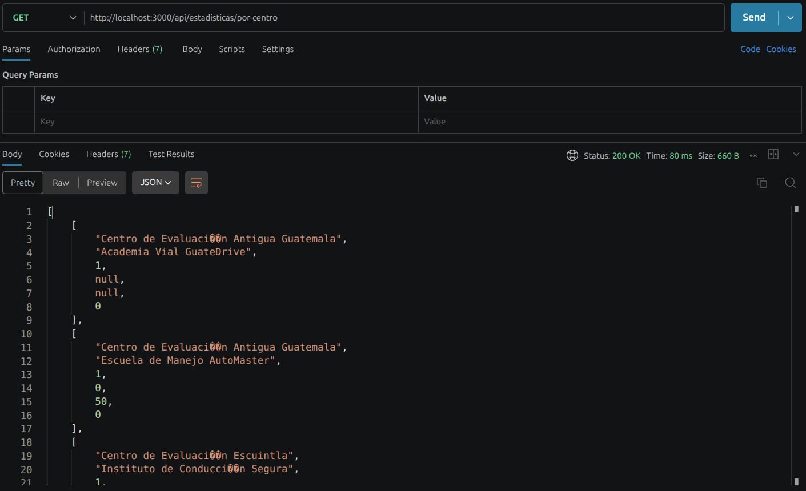

**Respuesta esperada:** 
```json
[
  {
    "CENTRO": "Centro de Evaluación Zona 12",
    "ESCUELA": "Escuela de Manejo AutoMaster",
    "TOTAL_EXAMENES": 2,
    "PROMEDIO_TEORICO_PCT": 75.5,
    "PROMEDIO_PRACTICO": 82.0,
    "APROBADOS": 2
  }
]
```

---

### Prueba 7 — Consulta 2: Ranking de Evaluados

**Request:** `GET http://localhost:3000/api/estadisticas/ranking`

---

### 📸 Captura 12 — Postman: GET /api/estadisticas/ranking

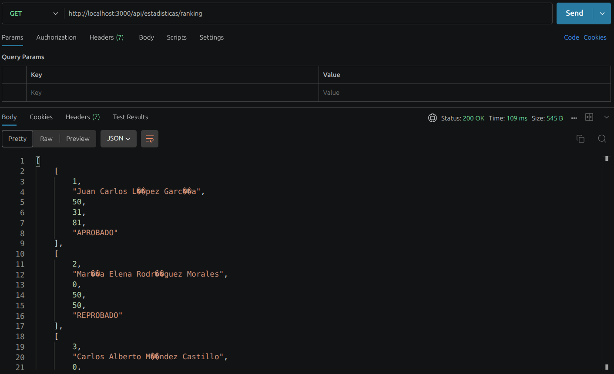

**Respuesta esperada:**
```json
[
  {
    "RANKING": 1,
    "NOMBRE_COMPLETO": "Juan Pérez García",
    "PUNTAJE_TEORICO": 85,
    "PUNTAJE_PRACTICO": 90,
    "PUNTAJE_TOTAL": 175,
    "RESULTADO": "APROBADO"
  }
]
```

---

### Prueba 8 — Consulta 3: Pregunta con Menor Aciertos

**Request:** `GET http://localhost:3000/api/estadisticas/pregunta-menor-aciertos`

---

### 📸 Captura 13 — Postman: GET /api/estadisticas/pregunta-menor-aciertos

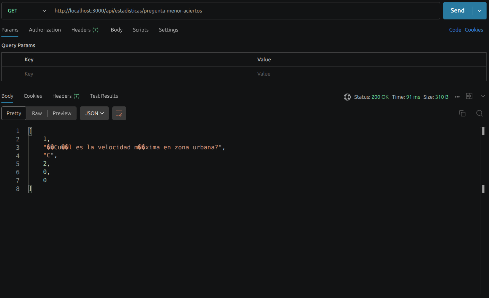

**Respuesta esperada:**
```json
{
  "ID_PREGUNTA": 2,
  "PREGUNTA_TEXTO": "¿Qué significa una luz roja en un semáforo?",
  "TOTAL_RESPUESTAS": 3,
  "ACIERTOS": 1,
  "PORCENTAJE_ACIERTOS": 33.33,
  "RESPUESTA_CORRECTA": "B"
}
```

---

## 📁 Estructura del Proyecto

```
SBD1B_1S2026_TUCARNET/
├── docker-compose.yml              ← Orquestación Docker
├── .env.example                    ← Plantilla de variables de entorno
├── .gitignore                      ← Archivos excluidos de Git
├── package.json                    ← Dependencias Node.js
├── README.md                       ← Este archivo
├── oracle-db/
│   └── init-scripts/
│       ├── 01_ddl.sql              ← Esquema de base de datos
│       └── 02_dml.sql              ← Datos de prueba
├── src/
│   ├── app.js                      ← Servidor Express principal
│   ├── config/
│   │   └── db.js                   ← Configuración de conexión Oracle
│   └── routes/
│       ├── departamento.js
│       ├── municipio.js
│       ├── centro.js
│       ├── escuela.js
│       ├── ubicacion.js
│       ├── registro.js
│       ├── correlativo.js
│       ├── examen.js
│       ├── preguntas.js
│       ├── preguntasPractico.js
│       ├── respuestaUsuario.js
│       ├── respuestaPracticoUsuario.js
│       └── estadisticas.js         ← 3 consultas estadísticas
└── postman/
    └── SBD1_Evaluacion.postman_collection.json
```

---

## 🛑 Comandos Útiles

```bash
# Levantar todos los servicios
docker compose up -d

# Ver logs de Oracle en tiempo real
docker logs -f oracle-xe-evaluacion

# Detener los servicios (conserva datos)
docker compose down

# Detener y eliminar todo (¡borra la BD!)
docker compose down -v

# Iniciar API en desarrollo
npm run dev

# Iniciar API en producción
npm start
```

---

## ⚠️ Penalizaciones a evitar

| Situación | Penalización |
|-----------|-------------|
| Docker no levantado al calificar | -30% |
| Uso de BD diferente a Oracle | -50% |
| No saber explicar el código | -30% |
| Documentación similar a otro estudiante | -20% |
| Entrega tardía | -100% |