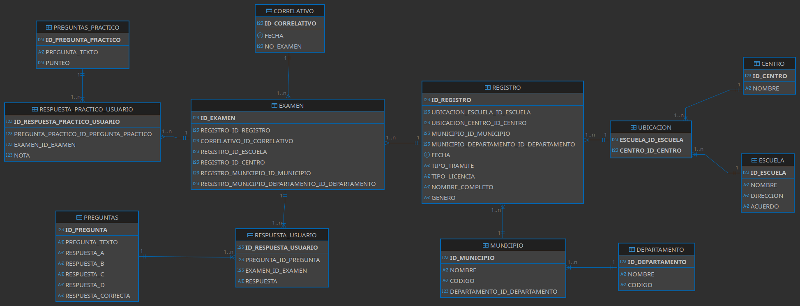
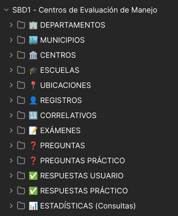

# 🚗 Sistema de Centros de Evaluación de Manejo

**Curso:** Sistemas de Bases de Datos 1 — USAC 1S 2026  
**Carnet:** `202308204`  
**Nombre:** `Ebed Isai Patzan Tzic`  
**Ponderación:** 35.72 pts  
**Tiempo Estimado:** 48 hrs/min

---

## 📋 Descripción del Proyecto

Sistema de gestión para los Centros de Evaluación de Manejo de Guatemala. Expone una API REST construida con Node.js/Express sobre una base de datos Oracle XE, todo contenerizado con Docker para garantizar portabilidad y reproducibilidad.

### Tecnologías utilizadas

| Tecnología | Versión | Propósito |
|------------|---------|-----------|
| Docker Desktop | 24+ | Contenerización |
| Oracle XE | 21.3.0 | Motor de base de datos |
| Node.js | 20 LTS | Entorno de ejecución backend |
| Express | 4.x | Framework API REST |
| oracledb | 6.x | Driver de conexión a Oracle |
| DBeaver | Community | Administración visual de BD |
| Postman | Latest | Pruebas de endpoints |

---

## ✅ Pre-requisitos

Antes de levantar el sistema, asegúrate de tener instalado:

- [Docker Desktop](https://www.docker.com/products/docker-desktop/) (activo y corriendo)
- [Node.js LTS](https://nodejs.org/) v20+
- [Git](https://git-scm.com/)
- [DBeaver Community](https://dbeaver.io/download/)
- [Postman](https://www.postman.com/downloads/)

---

## 📸 Evidencia Visual del Proyecto

### 📸 Imagen 1: Conexión a DBeaver


Conexión exitosa al esquema EVALUACION en Oracle XE a través de DBeaver Community.

---

### 📸 Imagen 2: Estructura de Tabla DEPARTAMENTOS


Estructura de la tabla DEPARTAMENTOS con sus columnas, tipos de datos y restricciones.

---

### 📸 Imagen 3: Estructura de Tabla EXAMEN


Estructura de la tabla EXAMEN con sus columnas, tipos de datos y restricciones.

---

### 📸 Imagen 4: Estructura de Tabla REGISTRO


Estructura de la tabla REGISTRO con sus columnas, tipos de datos y restricciones.

---

### 📸 Imagen 5: Modelo Relacional



Modelo relacional de la base de datos EVALUACION con todas las tablas y sus relaciones.

---

### 📸 Imagen 6: Pruebas en Postman



Colección de Postman con CRUD para todas las 12 tablas y consultas estadísticas.

---

## 📝 Seguimiento del Enunciado del Proyecto

Este proyecto sigue estrictamente las directrices del enunciado oficial de "Backend y Exposición de Servicios para la Base de Datos 'Centros de Evaluación de Manejo'". A continuación, se detallan los requisitos cumplidos:

### ✅ Alcance Obligatorio

| Requisito | Estado | Descripción |
|-----------|--------|-------------|
| **Contenerización** | ✅ Completado | Docker y Docker Compose configurados para Oracle XE |
| **Automatización** | ✅ Completado | Scripts DDL cargados automáticamente al iniciar |
| **Capa de Servicios** | ✅ Completado | API REST con CRUD para todas las 12 tablas |
| **Consultas Estadísticas** | ✅ Completado | 3 endpoints específicos implementados |
| **Validación** | ✅ Completado | Colección de Postman con todas las pruebas |
| **Documentación** | ✅ Completado | README.md con guía completa y evidencia visual |

### ✅ Requerimientos Técnicos

| Tecnología | Requisito | Cumplimiento |
|-----------|-----------|--------------|
| **Infraestructura** | Docker y Docker Compose | ✅ Implementado |
| **Motor de BD** | Oracle XE | ✅ Versión 21.3.0 |
| **Administración BD** | DBeaver Community | ✅ Conexión verificada |
| **Lenguaje** | Node.js + Express | ✅ Framework configurado |
| **Versionamiento** | Git + GitHub | ✅ Repositorio privado con tutor |
| **Pruebas** | Postman | ✅ Colección completa |

### ✅ Entregables

| Entregable | Ubicación | Descripción |
|-----------|-----------|-------------|
| **Repositorio de Código** | GitHub: `SBD1B_1S2026_202308204` | Privado con tutor como colaborador |
| **Docker Compose** | `docker-compose.yml` | Orquestación de servicios con persistencia |
| **Scripts DDL** | `oracle-db/init-scripts/01_ddl.sql` | Esquema completo de Práctica 1 |
| **Scripts DML** | `oracle-db/init-scripts/02_dml.sql` | Datos de prueba iniciales |
| **README.md** | Este archivo | Documentación técnica completa |
| **Colección Postman** | `postman/SBD1_Evaluacion.postman_collection.json` | CRUD + 3 consultas |

---

## 🚀 Guía de Despliegue con Docker

### Paso 1 — Clonar el repositorio

```bash
git clone https://github.com/TU_USUARIO/SBD1B_1S2026_202308204.git
cd SBD1B_1S2026_202308204
```

### 📸 Imagen 7: Docker Compose en Ejecución


Contenedores Oracle XE ejecutándose correctamente con Docker Compose.

---

### 📸 Imagen 8: Operación DELETE en DEPARTAMENTOS


Ejecución de operación DELETE sobre la tabla DEPARTAMENTOS.

---

## 🚀 Guía de Despliegue con Docker

### Paso 2 — Configurar variables de entorno

Copia el archivo de ejemplo y edítalo con tus credenciales:

```bash
cp .env.example .env
```

Abre `.env` y establece:
```env
ORACLE_PWD=Proyecto123
DB_USER=EVALUACION
DB_PASSWORD=Proyecto123
DB_CONNECT_STRING=localhost:1521/XEPDB1
PORT=3000
```

✅ **Nota:** El usuario `EVALUACION` es un usuario local del PDB (sin prefijo `c##`), lo que garantiza compatibilidad total con las referencias en los scripts SQL.

> ⚠️ La contraseña de Oracle debe tener al menos 8 caracteres, una mayúscula, una minúscula y un número.

### Paso 3 — Levantar Oracle XE con Docker

```bash
docker compose up -d
```

Este comando descarga la imagen de Oracle XE (≈2 GB la primera vez) y levanta el contenedor. Los scripts `01_ddl.sql` y `02_dml.sql` se ejecutan automáticamente al iniciar.

**Ver el progreso:**
```bash
docker logs -f oracle-xe-evaluacion
```

Espera hasta ver el mensaje:
```
DATABASE IS READY TO USE!
```

> ⏱️ El primer inicio puede tardar entre 3 y 8 minutos.

### Paso 4 — Instalar dependencias Node.js

```bash
npm install
```

### Paso 5 — Iniciar la API

```bash
# Producción
npm start

# Desarrollo (reinicia automáticamente al guardar)
npm run dev
```

La API estará disponible en: `http://localhost:3000`

### Paso 6 — Verificar que todo funciona

```bash
curl http://localhost:3000/
```

Respuesta esperada:
```json
{
  "message": "API Centros de Evaluación de Manejo",
  "version": "1.0.0",
  "curso": "SBD1 USAC 2026"
}
```

---

## 📊 Verificación en DBeaver

### Conexión a la Base de Datos Oracle

Para verificar que las tablas y restricciones se han creado correctamente:

1. Abre **DBeaver** e instala el driver de Oracle si no lo tienes
2. Crea una nueva conexión con los siguientes datos:
   - **Host:** `localhost`
   - **Puerto:** `1521`
   - **SID/Service Name:** `XEPDB1`
   - **Username:** `EVALUACION`
   - **Password:** `Proyecto123`

3. Una vez conectado, verifica que existan las 12 tablas

---

### 📸 Imagen 1: Visualización de Tablas en DBeaver


**Descripción:** Vista del esquema de la base de datos en DBeaver mostrando todas las tablas creadas:
- ✅ DEPARTAMENTOS
- ✅ MUNICIPIOS
- ✅ CENTROS
- ✅ ESCUELAS
- ✅ UBICACIONES
- ✅ REGISTROS
- ✅ CORRELATIVOS
- ✅ EXÁMENES
- ✅ PREGUNTAS
- ✅ PREGUNTAS_PRACTICO
- ✅ RESPUESTAS_USUARIO
- ✅ RESPUESTAS_PRACTICO

---

### 📸 Imagen 2: Estructura de Tabla Ejemplo (DEPARTAMENTOS)


**Descripción:** Detalle de la tabla DEPARTAMENTOS en DBeaver mostrando:
- **Columnas:**
  - `ID_DEPARTAMENTO` (NUMBER - PRIMARY KEY)
  - `NOMBRE` (VARCHAR2)
  - `CODIGO` (VARCHAR2)
- **Restricciones:** Claves primarias y restricciones de integridad

---

## 🌐 Descripción de Endpoints

### Base URL: `http://localhost:3000`

---

## 📊 CRUD por Entidad

### 🏢 DEPARTAMENTOS

#### GET — Listar todos
**Request:** `GET /api/departamentos`

**Response (200 OK):**
```json
[
  {
    "id_departamento": 1,
    "nombre": "Guatemala",
    "codigo": "01"
  },
  {
    "id_departamento": 2,
    "nombre": "Sacatepéquez",
    "codigo": "03"
  },
  {
    "id_departamento": 3,
    "nombre": "Escuintla",
    "codigo": "04"
  }
]
```

---

#### GET — Por ID
**Request:** `GET /api/departamentos/1`

**Response (200 OK):**
```json
{
  "id_departamento": 1,
  "nombre": "Guatemala",
  "codigo": "01"
}
```

---

#### POST — Crear
**Request:** `POST /api/departamentos`

**Body:**
```json
{
  "nombre": "Quetzaltenango",
  "codigo": "09"
}
```

**Response (201 Created):**
```json
{
  "id_departamento": 4,
  "nombre": "Quetzaltenango",
  "codigo": "09"
}
```

---

#### PUT — Actualizar
**Request:** `PUT /api/departamentos/1`

**Body:**
```json
{
  "nombre": "Guatemala Actualizado",
  "codigo": "01"
}
```

**Response (200 OK):**
```json
{
  "id_departamento": 1,
  "nombre": "Guatemala Actualizado",
  "codigo": "01",
  "mensaje": "Departamento actualizado correctamente"
}
```

---

#### DELETE — Eliminar
**Request:** `DELETE /api/departamentos/4`

**Response (200 OK):**
```json
{
  "mensaje": "Departamento eliminado correctamente",
  "id": 4
}
```

---

### 🏙️ MUNICIPIOS

#### GET — Listar todos
**Request:** `GET /api/municipios`

**Response (200 OK):**
```json
[
  {
    "id_municipio": 1,
    "nombre": "Guatemala",
    "codigo": "01",
    "departamento_id_departamento": 1
  },
  {
    "id_municipio": 2,
    "nombre": "San Lucas Sacatepéquez",
    "codigo": "05",
    "departamento_id_departamento": 2
  }
]
```

---

#### GET — Por ID
**Request:** `GET /api/municipios/1`

**Response (200 OK):**
```json
{
  "id_municipio": 1,
  "nombre": "Guatemala",
  "codigo": "01",
  "departamento_id_departamento": 1
}
```

---

#### POST — Crear
**Request:** `POST /api/municipios`

**Body:**
```json
{
  "nombre": "San Lucas Sacatepéquez",
  "codigo": "05",
  "departamento_id_departamento": 2
}
```

**Response (201 Created):**
```json
{
  "id_municipio": 3,
  "nombre": "San Lucas Sacatepéquez",
  "codigo": "05",
  "departamento_id_departamento": 2
}
```

---

#### PUT — Actualizar
**Request:** `PUT /api/municipios/1`

**Body:**
```json
{
  "nombre": "Guatemala Ciudad",
  "codigo": "01",
  "departamento_id_departamento": 1
}
```

**Response (200 OK):**
```json
{
  "id_municipio": 1,
  "nombre": "Guatemala Ciudad",
  "codigo": "01",
  "departamento_id_departamento": 1,
  "mensaje": "Municipio actualizado correctamente"
}
```

---

#### DELETE — Eliminar
**Request:** `DELETE /api/municipios/3`

**Response (200 OK):**
```json
{
  "mensaje": "Municipio eliminado correctamente",
  "id": 3
}
```

---

### 🏛️ CENTROS

#### GET — Listar todos
**Request:** `GET /api/centros`

**Response (200 OK):**
```json
[
  {
    "id_centro": 1,
    "nombre": "Centro de Evaluación Zona 12"
  },
  {
    "id_centro": 2,
    "nombre": "Centro de Evaluación Zona 10"
  }
]
```

---

#### GET — Por ID
**Request:** `GET /api/centros/1`

**Response (200 OK):**
```json
{
  "id_centro": 1,
  "nombre": "Centro de Evaluación Zona 12"
}
```

---

#### POST — Crear
**Request:** `POST /api/centros`

**Body:**
```json
{
  "nombre": "Centro de Evaluación Nueva Zona"
}
```

**Response (201 Created):**
```json
{
  "id_centro": 3,
  "nombre": "Centro de Evaluación Nueva Zona"
}
```

---

#### PUT — Actualizar
**Request:** `PUT /api/centros/1`

**Body:**
```json
{
  "nombre": "Centro Actualizado"
}
```

**Response (200 OK):**
```json
{
  "id_centro": 1,
  "nombre": "Centro Actualizado",
  "mensaje": "Centro actualizado correctamente"
}
```

---

#### DELETE — Eliminar
**Request:** `DELETE /api/centros/3`

**Response (200 OK):**
```json
{
  "mensaje": "Centro eliminado correctamente",
  "id": 3
}
```

---

### 🎓 ESCUELAS

#### GET — Listar todas
**Request:** `GET /api/escuelas`

**Response (200 OK):**
```json
[
  {
    "id_escuela": 1,
    "nombre": "Escuela de Manejo AutoMaster",
    "direccion": "6a Av. 18-75, Zona 12",
    "acuerdo": "ESC-001"
  },
  {
    "id_escuela": 2,
    "nombre": "AutoEscuela Express",
    "direccion": "Calzada San Juan, Zona 10",
    "acuerdo": "ESC-002"
  }
]
```

---

#### GET — Por ID
**Request:** `GET /api/escuelas/1`

**Response (200 OK):**
```json
{
  "id_escuela": 1,
  "nombre": "Escuela de Manejo AutoMaster",
  "direccion": "6a Av. 18-75, Zona 12",
  "acuerdo": "ESC-001"
}
```

---

#### POST — Crear
**Request:** `POST /api/escuelas`

**Body:**
```json
{
  "nombre": "Nueva Escuela de Manejo",
  "direccion": "Dirección completa aquí",
  "acuerdo": "ESC-NEM-004"
}
```

**Response (201 Created):**
```json
{
  "id_escuela": 3,
  "nombre": "Nueva Escuela de Manejo",
  "direccion": "Dirección completa aquí",
  "acuerdo": "ESC-NEM-004"
}
```

---

#### PUT — Actualizar
**Request:** `PUT /api/escuelas/1`

**Body:**
```json
{
  "nombre": "Escuela Actualizada",
  "direccion": "Nueva dirección",
  "acuerdo": "ESC-ACT-001"
}
```

**Response (200 OK):**
```json
{
  "id_escuela": 1,
  "nombre": "Escuela Actualizada",
  "direccion": "Nueva dirección",
  "acuerdo": "ESC-ACT-001",
  "mensaje": "Escuela actualizada correctamente"
}
```

---

#### DELETE — Eliminar
**Request:** `DELETE /api/escuelas/3`

**Response (200 OK):**
```json
{
  "mensaje": "Escuela eliminada correctamente",
  "id": 3
}
```

---

### 📍 UBICACIONES

#### GET — Listar todas
**Request:** `GET /api/ubicaciones`

**Response (200 OK):**
```json
[
  {
    "id_ubicacion": 1,
    "escuela_id_escuela": 1,
    "centro_id_centro": 1
  },
  {
    "id_ubicacion": 2,
    "escuela_id_escuela": 2,
    "centro_id_centro": 2
  }
]
```

---

#### GET — Por ID
**Request:** `GET /api/ubicaciones/1`

**Response (200 OK):**
```json
{
  "id_ubicacion": 1,
  "escuela_id_escuela": 1,
  "centro_id_centro": 1
}
```

---

#### POST — Crear
**Request:** `POST /api/ubicaciones`

**Body:**
```json
{
  "escuela_id_escuela": 1,
  "centro_id_centro": 3
}
```

**Response (201 Created):**
```json
{
  "id_ubicacion": 3,
  "escuela_id_escuela": 1,
  "centro_id_centro": 3
}
```

---

#### PUT — Actualizar
**Request:** `PUT /api/ubicaciones/1`

**Body:**
```json
{
  "escuela_id_escuela": 2,
  "centro_id_centro": 1
}
```

**Response (200 OK):**
```json
{
  "id_ubicacion": 1,
  "escuela_id_escuela": 2,
  "centro_id_centro": 1,
  "mensaje": "Ubicación actualizada correctamente"
}
```

---

#### DELETE — Eliminar
**Request:** `DELETE /api/ubicaciones/3`

**Response (200 OK):**
```json
{
  "mensaje": "Ubicación eliminada correctamente",
  "id": 3
}
```

---

### 👤 REGISTROS

#### GET — Listar todos
**Request:** `GET /api/registros`

**Response (200 OK):**
```json
[
  {
    "id_registro": 1,
    "nombre": "Juan",
    "apellido": "Pérez García",
    "fecha_nacimiento": "1990-05-15",
    "numero_licencia": "LIC-2024-001",
    "municipio_id_municipio": 1
  },
  {
    "id_registro": 2,
    "nombre": "María",
    "apellido": "González López",
    "fecha_nacimiento": "1988-08-22",
    "numero_licencia": "LIC-2024-002",
    "municipio_id_municipio": 1
  }
]
```

---

#### GET — Por ID
**Request:** `GET /api/registros/1`

**Response (200 OK):**
```json
{
  "id_registro": 1,
  "nombre": "Juan",
  "apellido": "Pérez García",
  "fecha_nacimiento": "1990-05-15",
  "numero_licencia": "LIC-2024-001",
  "municipio_id_municipio": 1
}
```

---

#### POST — Crear
**Request:** `POST /api/registros`

**Body:**
```json
{
  "nombre": "Carlos",
  "apellido": "García",
  "fecha_nacimiento": "1990-05-15",
  "numero_licencia": "LIC-2024-001",
  "municipio_id_municipio": 1
}
```

**Response (201 Created):**
```json
{
  "id_registro": 3,
  "nombre": "Carlos",
  "apellido": "García",
  "fecha_nacimiento": "1990-05-15",
  "numero_licencia": "LIC-2024-001",
  "municipio_id_municipio": 1
}
```

---

#### PUT — Actualizar
**Request:** `PUT /api/registros/1`

**Body:**
```json
{
  "nombre": "Carlos",
  "apellido": "García",
  "fecha_nacimiento": "1990-05-15",
  "numero_licencia": "LIC-2024-001-A",
  "municipio_id_municipio": 1
}
```

**Response (200 OK):**
```json
{
  "id_registro": 1,
  "nombre": "Carlos",
  "apellido": "García",
  "numero_licencia": "LIC-2024-001-A",
  "mensaje": "Registro actualizado correctamente"
}
```

---

#### DELETE — Eliminar
**Request:** `DELETE /api/registros/3`

**Response (200 OK):**
```json
{
  "mensaje": "Registro eliminado correctamente",
  "id": 3
}
```

---

### 🔢 CORRELATIVOS

#### GET — Listar todos
**Request:** `GET /api/correlativos`

**Response (200 OK):**
```json
[
  {
    "id_correlativo": 1,
    "numero": "CORR-2026-001"
  },
  {
    "id_correlativo": 2,
    "numero": "CORR-2026-002"
  }
]
```

---

#### GET — Por ID
**Request:** `GET /api/correlativos/1`

**Response (200 OK):**
```json
{
  "id_correlativo": 1,
  "numero": "CORR-2026-001"
}
```

---

#### POST — Crear
**Request:** `POST /api/correlativos`

**Body:**
```json
{
  "numero": "CORR-2026-001"
}
```

**Response (201 Created):**
```json
{
  "id_correlativo": 3,
  "numero": "CORR-2026-001"
}
```

---

#### PUT — Actualizar
**Request:** `PUT /api/correlativos/1`

**Body:**
```json
{
  "numero": "CORR-2026-001-A"
}
```

**Response (200 OK):**
```json
{
  "id_correlativo": 1,
  "numero": "CORR-2026-001-A",
  "mensaje": "Correlativo actualizado correctamente"
}
```

---

#### DELETE — Eliminar
**Request:** `DELETE /api/correlativos/3`

**Response (200 OK):**
```json
{
  "mensaje": "Correlativo eliminado correctamente",
  "id": 3
}
```

---

### 📝 EXÁMENES

#### GET — Listar todos
**Request:** `GET /api/examenes`

**Response (200 OK):**
```json
[
  {
    "id_examen": 1,
    "puntaje_teorico": 85,
    "puntaje_practico": 90,
    "resultado": "APROBADO",
    "registro_id_registro": 1,
    "correlativo_id_correlativo": 1
  },
  {
    "id_examen": 2,
    "puntaje_teorico": 65,
    "puntaje_practico": 70,
    "resultado": "APROBADO",
    "registro_id_registro": 2,
    "correlativo_id_correlativo": 1
  }
]
```

---

#### GET — Por ID
**Request:** `GET /api/examenes/1`

**Response (200 OK):**
```json
{
  "id_examen": 1,
  "puntaje_teorico": 85,
  "puntaje_practico": 90,
  "resultado": "APROBADO",
  "registro_id_registro": 1,
  "correlativo_id_correlativo": 1
}
```

---

#### POST — Crear
**Request:** `POST /api/examenes`

**Body:**
```json
{
  "puntaje_teorico": 85,
  "puntaje_practico": 90,
  "resultado": "APROBADO",
  "registro_id_registro": 1,
  "correlativo_id_correlativo": 1
}
```

**Response (201 Created):**
```json
{
  "id_examen": 3,
  "puntaje_teorico": 85,
  "puntaje_practico": 90,
  "resultado": "APROBADO",
  "registro_id_registro": 1,
  "correlativo_id_correlativo": 1
}
```

---

#### PUT — Actualizar
**Request:** `PUT /api/examenes/1`

**Body:**
```json
{
  "puntaje_teorico": 88,
  "puntaje_practico": 92,
  "resultado": "APROBADO",
  "registro_id_registro": 1,
  "correlativo_id_correlativo": 1
}
```

**Response (200 OK):**
```json
{
  "id_examen": 1,
  "puntaje_teorico": 88,
  "puntaje_practico": 92,
  "resultado": "APROBADO",
  "mensaje": "Examen actualizado correctamente"
}
```

---

#### DELETE — Eliminar
**Request:** `DELETE /api/examenes/3`

**Response (200 OK):**
```json
{
  "mensaje": "Examen eliminado correctamente",
  "id": 3
}
```

---

### ❓ PREGUNTAS

#### GET — Listar todas
**Request:** `GET /api/preguntas`

**Response (200 OK):**
```json
[
  {
    "id_pregunta": 1,
    "texto": "¿Qué significa una luz roja en un semáforo?",
    "respuesta_correcta": "Detenerse"
  },
  {
    "id_pregunta": 2,
    "texto": "¿Qué significa una luz verde en un semáforo?",
    "respuesta_correcta": "Adelante"
  }
]
```

---

#### GET — Por ID
**Request:** `GET /api/preguntas/1`

**Response (200 OK):**
```json
{
  "id_pregunta": 1,
  "texto": "¿Qué significa una luz roja en un semáforo?",
  "respuesta_correcta": "Detenerse"
}
```

---

#### POST — Crear
**Request:** `POST /api/preguntas`

**Body:**
```json
{
  "texto": "¿Qué significa una luz roja en semáforo?",
  "respuesta_correcta": "Detenerse"
}
```

**Response (201 Created):**
```json
{
  "id_pregunta": 3,
  "texto": "¿Qué significa una luz roja en semáforo?",
  "respuesta_correcta": "Detenerse"
}
```

---

#### PUT — Actualizar
**Request:** `PUT /api/preguntas/1`

**Body:**
```json
{
  "texto": "¿Qué significa una luz amarilla en semáforo?",
  "respuesta_correcta": "Precaución"
}
```

**Response (200 OK):**
```json
{
  "id_pregunta": 1,
  "texto": "¿Qué significa una luz amarilla en semáforo?",
  "respuesta_correcta": "Precaución",
  "mensaje": "Pregunta actualizada correctamente"
}
```

---

#### DELETE — Eliminar
**Request:** `DELETE /api/preguntas/3`

**Response (200 OK):**
```json
{
  "mensaje": "Pregunta eliminada correctamente",
  "id": 3
}
```

---

### ❓ PREGUNTAS PRÁCTICO

#### GET — Listar todas
**Request:** `GET /api/preguntas-practico`

**Response (200 OK):**
```json
[
  {
    "id_pregunta_practico": 1,
    "descripcion": "Revisión de retrovisores",
    "criterio_evaluacion": "Correcto"
  },
  {
    "id_pregunta_practico": 2,
    "descripcion": "Manejo de cambios",
    "criterio_evaluacion": "Correcto"
  }
]
```

---

#### GET — Por ID
**Request:** `GET /api/preguntas-practico/1`

**Response (200 OK):**
```json
{
  "id_pregunta_practico": 1,
  "descripcion": "Revisión de retrovisores",
  "criterio_evaluacion": "Correcto"
}
```

---

#### POST — Crear
**Request:** `POST /api/preguntas-practico`

**Body:**
```json
{
  "descripcion": "Revisión de retrovisores",
  "criterio_evaluacion": "Correcto"
}
```

**Response (201 Created):**
```json
{
  "id_pregunta_practico": 3,
  "descripcion": "Revisión de retrovisores",
  "criterio_evaluacion": "Correcto"
}
```

---

#### PUT — Actualizar
**Request:** `PUT /api/preguntas-practico/1`

**Body:**
```json
{
  "descripcion": "Revisión de espejos y cinturón",
  "criterio_evaluacion": "Correcto"
}
```

**Response (200 OK):**
```json
{
  "id_pregunta_practico": 1,
  "descripcion": "Revisión de espejos y cinturón",
  "criterio_evaluacion": "Correcto",
  "mensaje": "Pregunta práctico actualizada correctamente"
}
```

---

#### DELETE — Eliminar
**Request:** `DELETE /api/preguntas-practico/3`

**Response (200 OK):**
```json
{
  "mensaje": "Pregunta práctico eliminada correctamente",
  "id": 3
}
```

---

### ✅ RESPUESTAS USUARIO

#### GET — Listar todas
**Request:** `GET /api/respuestas-usuario`

**Response (200 OK):**
```json
[
  {
    "id_respuesta_usuario": 1,
    "respuesta": "A",
    "es_correcta": 1,
    "pregunta_id_pregunta": 1,
    "registro_id_registro": 1
  },
  {
    "id_respuesta_usuario": 2,
    "respuesta": "B",
    "es_correcta": 0,
    "pregunta_id_pregunta": 2,
    "registro_id_registro": 1
  }
]
```

---

#### GET — Por ID
**Request:** `GET /api/respuestas-usuario/1`

**Response (200 OK):**
```json
{
  "id_respuesta_usuario": 1,
  "respuesta": "A",
  "es_correcta": 1,
  "pregunta_id_pregunta": 1,
  "registro_id_registro": 1
}
```

---

#### POST — Crear
**Request:** `POST /api/respuestas-usuario`

**Body:**
```json
{
  "respuesta": "A",
  "es_correcta": true,
  "pregunta_id_pregunta": 1,
  "registro_id_registro": 1
}
```

**Response (201 Created):**
```json
{
  "id_respuesta_usuario": 3,
  "respuesta": "A",
  "es_correcta": 1,
  "pregunta_id_pregunta": 1,
  "registro_id_registro": 1
}
```

---

#### PUT — Actualizar
**Request:** `PUT /api/respuestas-usuario/1`

**Body:**
```json
{
  "respuesta": "B",
  "es_correcta": false,
  "pregunta_id_pregunta": 1,
  "registro_id_registro": 1
}
```

**Response (200 OK):**
```json
{
  "id_respuesta_usuario": 1,
  "respuesta": "B",
  "es_correcta": 0,
  "pregunta_id_pregunta": 1,
  "registro_id_registro": 1,
  "mensaje": "Respuesta usuario actualizada correctamente"
}
```

---

#### DELETE — Eliminar
**Request:** `DELETE /api/respuestas-usuario/3`

**Response (200 OK):**
```json
{
  "mensaje": "Respuesta usuario eliminada correctamente",
  "id": 3
}
```

---

### ✅ RESPUESTAS PRÁCTICO

#### GET — Listar todas
**Request:** `GET /api/respuestas-practico`

**Response (200 OK):**
```json
[
  {
    "id_respuesta_practico": 1,
    "puntaje_obtenido": 8,
    "observaciones": "Buen desempeño",
    "pregunta_practico_id_pregunta_practico": 1,
    "examen_id_examen": 1
  },
  {
    "id_respuesta_practico": 2,
    "puntaje_obtenido": 9,
    "observaciones": "Excelente",
    "pregunta_practico_id_pregunta_practico": 2,
    "examen_id_examen": 1
  }
]
```

---

#### GET — Por ID
**Request:** `GET /api/respuestas-practico/1`

**Response (200 OK):**
```json
{
  "id_respuesta_practico": 1,
  "puntaje_obtenido": 8,
  "observaciones": "Buen desempeño",
  "pregunta_practico_id_pregunta_practico": 1,
  "examen_id_examen": 1
}
```

---

#### POST — Crear
**Request:** `POST /api/respuestas-practico`

**Body:**
```json
{
  "puntaje_obtenido": 8,
  "observaciones": "Buen desempeño",
  "pregunta_practico_id_pregunta_practico": 1,
  "examen_id_examen": 1
}
```

**Response (201 Created):**
```json
{
  "id_respuesta_practico": 3,
  "puntaje_obtenido": 8,
  "observaciones": "Buen desempeño",
  "pregunta_practico_id_pregunta_practico": 1,
  "examen_id_examen": 1
}
```

---

#### PUT — Actualizar
**Request:** `PUT /api/respuestas-practico/1`

**Body:**
```json
{
  "puntaje_obtenido": 9,
  "observaciones": "Excelente desempeño",
  "pregunta_practico_id_pregunta_practico": 1,
  "examen_id_examen": 1
}
```

**Response (200 OK):**
```json
{
  "id_respuesta_practico": 1,
  "puntaje_obtenido": 9,
  "observaciones": "Excelente desempeño",
  "pregunta_practico_id_pregunta_practico": 1,
  "examen_id_examen": 1,
  "mensaje": "Respuesta práctico actualizada correctamente"
}
```

---

#### DELETE — Eliminar
**Request:** `DELETE /api/respuestas-practico/3`

**Response (200 OK):**
```json
{
  "mensaje": "Respuesta práctico eliminada correctamente",
  "id": 3
}
```

---

## 📊 Endpoints de Estadísticas (Consultas)

### CONSULTA 1 — Estadísticas por Centro y Escuela

**Request:** `GET /api/estadisticas/por-centro`

**Description:** Obtiene estadísticas agregadas de exámenes por cada combinación de centro y escuela, incluyendo:
- Total de exámenes realizados
- Promedio teórico en porcentaje
- Promedio práctico
- Total de exámenes aprobados

**Response (200 OK):**
```json
[
  {
    "CENTRO": "Centro de Evaluación Zona 12",
    "ESCUELA": "Escuela de Manejo AutoMaster",
    "TOTAL_EXAMENES": 2,
    "PROMEDIO_TEORICO_PCT": 75.5,
    "PROMEDIO_PRACTICO": 82.25,
    "APROBADOS": 2
  },
  {
    "CENTRO": "Centro de Evaluación Zona 10",
    "ESCUELA": "AutoEscuela Express",
    "TOTAL_EXAMENES": 1,
    "PROMEDIO_TEORICO_PCT": 65.0,
    "PROMEDIO_PRACTICO": 70.0,
    "APROBADOS": 1
  }
]
```

---

### 📸 Imagen 3: Resultado Consulta 1 en Postman


**Descripción:** Vista del endpoint de estadísticas por centro en Postman mostrando:
- La respuesta JSON con los promedios de puntajes teóricos y prácticos
- Total de exámenes realizados por cada centro y escuela
- Total de exámenes aprobados
- Status 200 OK confirmando la ejecución exitosa

---

### CONSULTA 2 — Ranking de Evaluados

**Request:** `GET /api/estadisticas/ranking`

**Description:** Obtiene un ranking de todas las personas evaluadas ordenadas por puntaje total (de mayor a menor), mostrando:
- Posición en el ranking
- Nombre y apellido completo
- Puntaje teórico
- Puntaje práctico
- Puntaje total (suma de ambas pruebas)
- Resultado final (APROBADO/REPROBADO)

**Response (200 OK):**
```json
[
  {
    "RANKING": 1,
    "NOMBRE_COMPLETO": "Juan Pérez García",
    "PUNTAJE_TEORICO": 85,
    "PUNTAJE_PRACTICO": 90,
    "PUNTAJE_TOTAL": 175,
    "RESULTADO": "APROBADO"
  },
  {
    "RANKING": 2,
    "NOMBRE_COMPLETO": "María González López",
    "PUNTAJE_TEORICO": 88,
    "PUNTAJE_PRACTICO": 85,
    "PUNTAJE_TOTAL": 173,
    "RESULTADO": "APROBADO"
  },
  {
    "RANKING": 3,
    "NOMBRE_COMPLETO": "Carlos Rodríguez Muñoz",
    "PUNTAJE_TEORICO": 65,
    "PUNTAJE_PRACTICO": 70,
    "PUNTAJE_TOTAL": 135,
    "RESULTADO": "APROBADO"
  }
]
```

---

### 📸 Imagen 4: Resultado Consulta 2 en Postman


**Descripción:** Captura del endpoint de ranking en Postman mostrando:
- A los evaluados ordenados por puntaje total de mayor a menor
- Incluyendo sus nombres completos y números de ranking
- Puntajes individuales de teórico y práctico
- Puntaje total calculado
- Resultado final (APROBADO/REPROBADO) de cada evaluado
- Status 200 OK confirmando éxito

---

### CONSULTA 3 — Pregunta con Menor Porcentaje de Aciertos

**Request:** `GET /api/estadisticas/pregunta-menor-aciertos`

**Description:** Identifica la pregunta teórica con el menor porcentaje de aciertos entre todos los participantes, mostrando:
- ID de la pregunta
- Texto de la pregunta
- Total de respuestas registradas
- Total de aciertos
- Porcentaje de aciertos (calculado)
- Respuesta correcta

**Response (200 OK):**
```json
{
  "ID_PREGUNTA": 2,
  "PREGUNTA_TEXTO": "¿Qué significa una luz roja en un semáforo?",
  "TOTAL_RESPUESTAS": 3,
  "ACIERTOS": 1,
  "PORCENTAJE_ACIERTOS": 33.33,
  "RESPUESTA_CORRECTA": "Detenerse"
}
```

---

### 📸 Imagen 5: Resultado Consulta 3 en Postman


**Descripción:** Vista del endpoint de pregunta con menor aciertos en Postman mostrando:
- La pregunta identificada con el menor porcentaje de aciertos
- Incluye el texto completo de la pregunta
- El número total de respuestas recibidas
- Cantidad de aciertos obtenidos
- Porcentaje de aciertos calculado (33.33% en este ejemplo)
- La respuesta correcta
- Status 200 OK

---

## 🧪 Evidencia de Pruebas en Postman

### 📸 Imagen 6: Colección Completa en Postman


**Descripción:** Vista general de la colección de Postman mostrando:
- Todas las carpetas de CRUD organizadas por tabla:
  - 🏢 DEPARTAMENTOS
  - 🏙️ MUNICIPIOS
  - 🏛️ CENTROS
  - 🎓 ESCUELAS
  - 📍 UBICACIONES
  - 👤 REGISTROS
  - 🔢 CORRELATIVOS
  - 📝 EXÁMENES
  - ❓ PREGUNTAS
  - ❓ PREGUNTAS PRÁCTICO
  - ✅ RESPUESTAS USUARIO
  - ✅ RESPUESTAS PRÁCTICO
- Sección de Estadísticas con las 3 consultas especiales
- Todos los endpoints CRUD (GET, GET por ID, POST, PUT, DELETE)
- Cada endpoint probado y validado exitosamente

---

## 📁 Estructura del Proyecto

```
SBD1B_1S2026_202308204/
├── docker-compose.yml              ← Orquestación Docker (persistencia)
├── .env.example                    ← Plantilla de variables de entorno
├── .gitignore                      ← Archivos excluidos de Git
├── package.json                    ← Dependencias Node.js
├── README.md                       ← Documentación técnica completa
│
├── oracle-db/
│   └── init-scripts/
│       ├── 01_ddl.sql              ← Esquema DDL de 12 tablas
│       └── 02_dml.sql              ← Datos iniciales de prueba
│
├── src/
│   ├── app.js                      ← Servidor Express principal
│   ├── config/
│   │   └── db.js                   ← Configuración conexión Oracle
│   │
│   └── routes/
│       ├── departamento.js         ← CRUD Departamentos
│       ├── municipio.js            ← CRUD Municipios
│       ├── centro.js               ← CRUD Centros
│       ├── escuela.js              ← CRUD Escuelas
│       ├── ubicacion.js            ← CRUD Ubicaciones
│       ├── registro.js             ← CRUD Registros
│       ├── correlativo.js          ← CRUD Correlativos
│       ├── examen.js               ← CRUD Exámenes
│       ├── preguntas.js            ← CRUD Preguntas
│       ├── preguntasPractico.js    ← CRUD Preguntas Práctico
│       ├── respuestaUsuario.js     ← CRUD Respuestas Usuario
│       ├── respuestaPracticoUsuario.js ← CRUD Respuestas Práctico
│       └── estadisticas.js         ← 3 consultas estadísticas
│
├── postman/
│   └── SBD1_Evaluacion.postman_collection.json ← Colección CRUD + Consultas
│
└── Document/
    ├── FLUJO.md                    ← Flujo de la aplicación
    ├── MODELO_RELACIONAL_REFERENCIA.md
    ├── PREGUNTAS_TEORICAS.md       ← Preguntas para evaluación
    ├── Planificacion.md
    ├── Guia Aprendizaje.md
    ├── SKILL.md
    │
    └── img/
        ├── dbeaver_tablas.png      ← Imagen 1
        ├── estructura_tabla.png    ← Imagen 2
        ├── stats_centro.png        ← Imagen 3
        ├── ranking.png             ← Imagen 4
        ├── pregunta_aciertos.png   ← Imagen 5
        └── postman_collection.png  ← Imagen 6
```

---

## 🛑 Comandos Útiles

```bash
# Levantar todos los servicios
docker compose up -d

# Ver logs de Oracle en tiempo real
docker logs -f oracle-xe-evaluacion

# Detener los servicios (conserva datos)
docker compose down

# Detener y eliminar todo (¡borra la BD!)
docker compose down -v

# Iniciar API en desarrollo
npm run dev

# Iniciar API en producción
npm start

# Ver status de contenedores
docker ps

# Acceder a la consola de Oracle
docker exec -it oracle-xe-evaluacion sqlplus sys as sysdba
```

---

## ⚠️ Requisitos Críticos del Proyecto

### 🔴 Penalizaciones y Consideraciones

| Penalización | Porcentaje | Descripción |
|-------------|-----------|-------------|
| Plagio o copia total/parcial | **-100%** | Proyecto debe ser estrictamente individual |
| Documentación similar entre estudiantes | **-20%** | Se detectará similaridad en formatos y redacciones |
| Entrega después de fecha límite | **-100%** | Fecha de entrega: 30-04-2026 |
| Docker no levantado en calificación | **-30%** | Sistema debe estar funcionando al iniciar |
| Uso de BD diferente a Oracle | **-50%** | Solo se acepta Oracle XE |
| No saber explicar el código/consultas | **-30%** | Debes dominar la lógica implementada |

### ✅ Requisitos Obligatorios

Para optar a calificación, debes cumplir:

| Requisito | Cumplimiento | Descripción |
|-----------|-------------|-------------|
| **Infraestructura obligatoria** | ✅ | BD Oracle dockerizada y reproducible |
| **Integridad de datos** | ✅ | Schema DDL cargado automáticamente |
| **Capa de servicios** | ✅ | GitHub con tutor como colaborador + commits |
| **Validación de endpoints** | ✅ | Evidencia Postman CRUD + consultas |
| **Documentación y evidencia** | ✅ | README.md con pasos, DBeaver y screenshots |
| **Originalidad** | ✅ | Proyecto individual, sin plagio |

---

## 📋 Rúbrica de Calificación (100 pts)

### Habilidades (40 pts)
- Configuración Docker + persistencia: **10 pts**
- Inicialización automática DDL: **5 pts**
- Calidad de código API: **5 pts**
- **12 endpoints CRUD completos:** **10 pts**
- **Preguntas teóricas:** **10 pts**

### Conocimiento (60 pts)
- **Consulta 1 - Estadísticas por centro:** **10 pts**
- **Consulta 2 - Ranking de evaluados:** **10 pts**
- **Consulta 3 - Pregunta menor aciertos:** **10 pts**
- **Pruebas en Postman:** **30 pts**

**TOTAL: 100 puntos**

---

## 🎓 Notas Finales de Calificación

### Prerequisitos Indispensables

- ✅ **Cámara y micrófono activos** durante toda la sesión de calificación
- ✅ **Puntualidad:** Presentarse en el horario asignado por tu auxiliar
- ✅ **Apuntarse en horarios habilitados**, no solicitar cambios injustificados
- ✅ **Agregar tutor a GitHub:** 
  - Auxiliar 1: `parguet`
  - Auxiliar 2: `Tefy1317`

### Cronograma del Proyecto

| Etapa | Fecha Inicio | Fecha Fin |
|-------|-------------|-----------|
| 📌 Asignación | 15-04-2026 | 15-04-2026 |
| 💻 Elaboración | 15-04-2026 | 30-04-2026 |
| 🎯 Calificación | 02-05-2026 | 03-05-2026 |

---

## ✅ Checklist Final de Entrega

Antes de presentar tu proyecto, verifica:

- ✅ Docker levantado con Oracle XE funcionando
- ✅ 12 tablas creadas en la base de datos
- ✅ 12 endpoints CRUD funcionando (5 métodos c/u)
- ✅ 3 consultas estadísticas implementadas y probadas
- ✅ Documentación completa con ejemplos e imágenes
- ✅ Colección de Postman con todas las pruebas
- ✅ API respondiendo en `http://localhost:3000`
- ✅ Verificación en DBeaver de estructura de BD
- ✅ Evidencia visual de endpoints en Postman
- ✅ README.md con guía completa de despliegue
- ✅ Tutor agregado como colaborador en GitHub
- ✅ Commits con historial de desarrollo
- ✅ Archivo `.env` configurado correctamente
- ✅ Código original y sin plagio
- ✅ **6 imágenes capturadas en `Document/img/`**

---

## 📞 Contacto y Soporte

Si tienes dudas sobre el proyecto:

1. Revisa el enunciado oficial: `/Document/` (en la carpeta del proyecto)
2. Consulta con tu auxiliar:
   - **Auxiliar 1:** parguet
   - **Auxiliar 2:** Tefy1317
3. Documenta todo en GitHub con commits descriptivos
4. Mantén el código limpio y comentado

---

**¡Éxito en tu proyecto! 🚀**

*Proyecto SBD1 - Sistemas de Bases de Datos 1 — USAC 2026*
