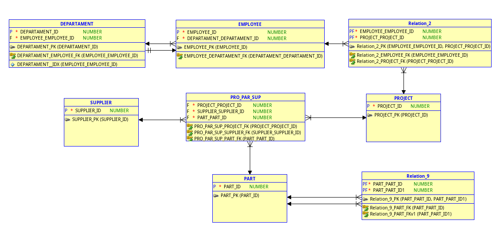

# Modelado de Diagramas ER con Data Modeler y Ejemplo Completo en MySQL

Este documento muestra el flujo logico para pasar de un modelo ER (notacion Barker) a un modelo relacional y finalmente a la ejecucion del script SQL. Al final se incluye un ejemplo completo en MySQL equivalente al modelo.
## Nombre : Ebed Isai Patzan Tzic
## Carnet : 202308204

## 1. Modelo ER (vista logica inicial)

En esta etapa se definen entidades y relaciones de negocio: `DEPARTAMENT`, `EMPLOYEE`, `PROJECT`, `SUPPLIER`, `PART` y relaciones asociativas.


## 2. Revision de la vista logica en Data Modeler

Aqui se visualiza el diagrama dentro de Oracle SQL Developer Data Modeler antes de transformarlo al modelo relacional.


## 3. Ingenieria a modelo relacional

En este paso se usa la opcion de ingenieria para convertir entidades y relaciones en tablas, claves primarias y foraneas.


## 4. Resultado del modelo relacional

Se observan tablas resultantes y tablas puente para resolver relaciones muchos a muchos y autorrelaciones.



## 5. Configuracion para generar DDL

Se seleccionan objetos y opciones de salida para construir el script SQL desde el modelo relacional.


## 6. DDL generado

Data Modeler produce el script `CREATE TABLE`, indices y restricciones.


## 7. Ejecucion del script SQL

Finalmente, el DDL se ejecuta en el motor de base de datos para crear el esquema fisico.


---

## 8. Ejemplo completo equivalente en MySQL

El siguiente ejemplo implementa el mismo tipo de estructura del diagrama en MySQL 8.0+.

```sql
-- =========================================
-- 0) Crear base de datos
-- =========================================
DROP DATABASE IF EXISTS er_barker_demo;
CREATE DATABASE er_barker_demo CHARACTER SET utf8mb4 COLLATE utf8mb4_0900_ai_ci;
USE er_barker_demo;

-- =========================================
-- 1) Tablas principales
-- =========================================
CREATE TABLE department (
	department_id BIGINT UNSIGNED AUTO_INCREMENT,
	name VARCHAR(120) NOT NULL,
	manager_employee_id BIGINT UNSIGNED NULL,
	created_at TIMESTAMP NOT NULL DEFAULT CURRENT_TIMESTAMP,
	PRIMARY KEY (department_id),
	UNIQUE KEY uq_department_manager (manager_employee_id)
) ENGINE=InnoDB;

CREATE TABLE employee (
	employee_id BIGINT UNSIGNED AUTO_INCREMENT,
	department_id BIGINT UNSIGNED NULL,
	full_name VARCHAR(150) NOT NULL,
	email VARCHAR(180) NULL,
	hired_on DATE NOT NULL,
	PRIMARY KEY (employee_id),
	UNIQUE KEY uq_employee_email (email),
	KEY idx_employee_department (department_id),
	CONSTRAINT fk_employee_department
		FOREIGN KEY (department_id)
		REFERENCES department (department_id)
		ON UPDATE CASCADE
		ON DELETE SET NULL
) ENGINE=InnoDB;

-- Relacion circular: department.manager -> employee.employee_id
ALTER TABLE department
	ADD CONSTRAINT fk_department_manager
	FOREIGN KEY (manager_employee_id)
	REFERENCES employee (employee_id)
	ON UPDATE CASCADE
	ON DELETE SET NULL;

CREATE TABLE project (
	project_id BIGINT UNSIGNED AUTO_INCREMENT,
	project_code VARCHAR(30) NOT NULL,
	project_name VARCHAR(140) NOT NULL,
	start_date DATE NOT NULL,
	end_date DATE NULL,
	PRIMARY KEY (project_id),
	UNIQUE KEY uq_project_code (project_code)
) ENGINE=InnoDB;

CREATE TABLE supplier (
	supplier_id BIGINT UNSIGNED AUTO_INCREMENT,
	supplier_name VARCHAR(140) NOT NULL,
	phone VARCHAR(30) NULL,
	PRIMARY KEY (supplier_id)
) ENGINE=InnoDB;

CREATE TABLE part (
	part_id BIGINT UNSIGNED AUTO_INCREMENT,
	part_code VARCHAR(30) NOT NULL,
	description VARCHAR(180) NOT NULL,
	unit_cost DECIMAL(12,2) NOT NULL,
	PRIMARY KEY (part_id),
	UNIQUE KEY uq_part_code (part_code)
) ENGINE=InnoDB;

-- =========================================
-- 2) Tablas de relacion
-- =========================================

-- EMPLOYEE <-> PROJECT (muchos a muchos)
CREATE TABLE employee_project (
	employee_id BIGINT UNSIGNED NOT NULL,
	project_id BIGINT UNSIGNED NOT NULL,
	role_name VARCHAR(80) NOT NULL,
	assigned_at DATE NOT NULL,
	PRIMARY KEY (employee_id, project_id),
	KEY idx_ep_project (project_id),
	CONSTRAINT fk_ep_employee
		FOREIGN KEY (employee_id)
		REFERENCES employee (employee_id)
		ON UPDATE CASCADE
		ON DELETE CASCADE,
	CONSTRAINT fk_ep_project
		FOREIGN KEY (project_id)
		REFERENCES project (project_id)
		ON UPDATE CASCADE
		ON DELETE CASCADE
) ENGINE=InnoDB;

-- PROJECT <-> SUPPLIER <-> PART (relacion ternaria)
CREATE TABLE project_supplier_part (
	project_id BIGINT UNSIGNED NOT NULL,
	supplier_id BIGINT UNSIGNED NOT NULL,
	part_id BIGINT UNSIGNED NOT NULL,
	quantity INT UNSIGNED NOT NULL,
	agreed_price DECIMAL(12,2) NOT NULL,
	PRIMARY KEY (project_id, supplier_id, part_id),
	KEY idx_psp_supplier (supplier_id),
	KEY idx_psp_part (part_id),
	CONSTRAINT fk_psp_project
		FOREIGN KEY (project_id)
		REFERENCES project (project_id)
		ON UPDATE CASCADE
		ON DELETE CASCADE,
	CONSTRAINT fk_psp_supplier
		FOREIGN KEY (supplier_id)
		REFERENCES supplier (supplier_id)
		ON UPDATE CASCADE
		ON DELETE RESTRICT,
	CONSTRAINT fk_psp_part
		FOREIGN KEY (part_id)
		REFERENCES part (part_id)
		ON UPDATE CASCADE
		ON DELETE RESTRICT
) ENGINE=InnoDB;

-- Autorrelacion PART <-> PART (composicion de piezas)
CREATE TABLE part_component (
	parent_part_id BIGINT UNSIGNED NOT NULL,
	component_part_id BIGINT UNSIGNED NOT NULL,
	component_qty DECIMAL(10,2) NOT NULL,
	PRIMARY KEY (parent_part_id, component_part_id),
	KEY idx_pc_component (component_part_id),
	CONSTRAINT fk_pc_parent
		FOREIGN KEY (parent_part_id)
		REFERENCES part (part_id)
		ON UPDATE CASCADE
		ON DELETE CASCADE,
	CONSTRAINT fk_pc_component
		FOREIGN KEY (component_part_id)
		REFERENCES part (part_id)
		ON UPDATE CASCADE
		ON DELETE RESTRICT,
	CONSTRAINT chk_pc_distinct CHECK (parent_part_id <> component_part_id)
) ENGINE=InnoDB;

-- =========================================
-- 3) Datos de ejemplo
-- =========================================
INSERT INTO department (name) VALUES
	('Ingenieria'),
	('Operaciones');

INSERT INTO employee (department_id, full_name, email, hired_on) VALUES
	(1, 'Ana Perez', 'ana.perez@demo.com', '2024-01-15'),
	(1, 'Luis Gomez', 'luis.gomez@demo.com', '2024-02-01'),
	(2, 'Marta Ruiz', 'marta.ruiz@demo.com', '2024-03-10');

UPDATE department SET manager_employee_id = 1 WHERE department_id = 1;
UPDATE department SET manager_employee_id = 3 WHERE department_id = 2;

INSERT INTO project (project_code, project_name, start_date, end_date) VALUES
	('PRJ-ALFA', 'Modernizacion de Planta', '2025-01-01', NULL),
	('PRJ-BETA', 'Sistema de Inventario', '2025-02-15', NULL);

INSERT INTO supplier (supplier_name, phone) VALUES
	('Suministros Industriales SA', '+502 5555-1000'),
	('Partes y Motores GT', '+502 5555-2000');

INSERT INTO part (part_code, description, unit_cost) VALUES
	('P-MOTOR', 'Motor principal', 1500.00),
	('P-EJE', 'Eje de transmision', 250.00),
	('P-TORN', 'Tornillo 8mm', 0.15),
	('P-BASE', 'Base estructural', 300.00);

INSERT INTO employee_project (employee_id, project_id, role_name, assigned_at) VALUES
	(1, 1, 'Lider Tecnico', '2025-01-03'),
	(2, 1, 'Ingeniero de Campo', '2025-01-05'),
	(3, 2, 'Coordinadora', '2025-02-20');

INSERT INTO project_supplier_part (project_id, supplier_id, part_id, quantity, agreed_price) VALUES
	(1, 1, 1, 2, 1450.00),
	(1, 2, 2, 4, 240.00),
	(1, 2, 3, 500, 0.12),
	(2, 1, 4, 8, 290.00);

INSERT INTO part_component (parent_part_id, component_part_id, component_qty) VALUES
	(1, 2, 1.00),
	(1, 3, 12.00),
	(4, 3, 20.00);

-- =========================================
-- 4) Consultas de validacion
-- =========================================

-- Empleados por proyecto
SELECT
	p.project_code,
	p.project_name,
	e.full_name,
	ep.role_name
FROM employee_project ep
JOIN employee e ON e.employee_id = ep.employee_id
JOIN project p ON p.project_id = ep.project_id
ORDER BY p.project_code, e.full_name;

-- Piezas suministradas por proveedor en cada proyecto
SELECT
	p.project_code,
	s.supplier_name,
	pa.part_code,
	psp.quantity,
	psp.agreed_price
FROM project_supplier_part psp
JOIN project p ON p.project_id = psp.project_id
JOIN supplier s ON s.supplier_id = psp.supplier_id
JOIN part pa ON pa.part_id = psp.part_id
ORDER BY p.project_code, s.supplier_name, pa.part_code;

-- Composicion de piezas (BOM simplificado)
SELECT
	p1.part_code AS parent_part,
	p2.part_code AS component_part,
	pc.component_qty
FROM part_component pc
JOIN part p1 ON p1.part_id = pc.parent_part_id
JOIN part p2 ON p2.part_id = pc.component_part_id
ORDER BY p1.part_code, p2.part_code;
```

## 9. Conclusiones

1. El flujo recomendado en Data Modeler es: modelo logico -> modelo relacional -> DDL -> ejecucion.
2. Las relaciones muchos a muchos y ternarias se implementan con tablas asociativas.
3. El ejemplo en MySQL permite replicar el modelo, poblar datos y validar integridad referencial con consultas reales.

