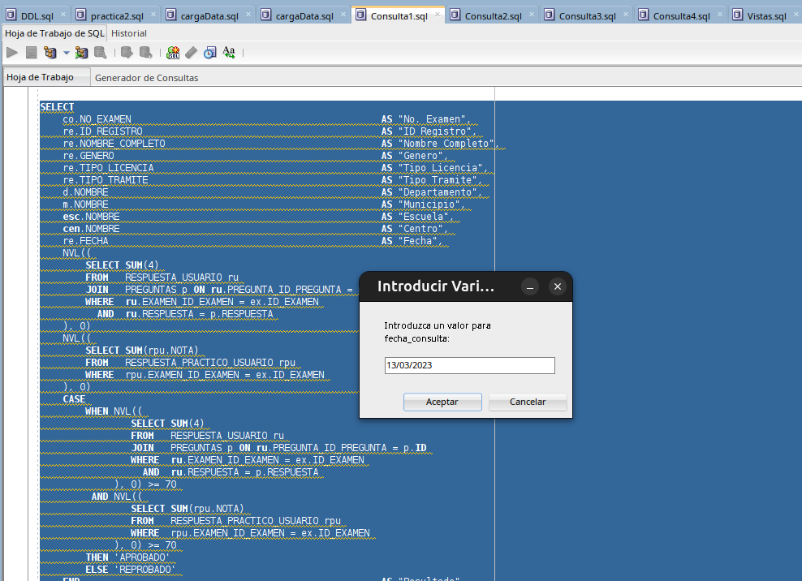
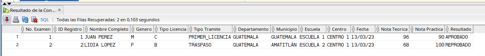
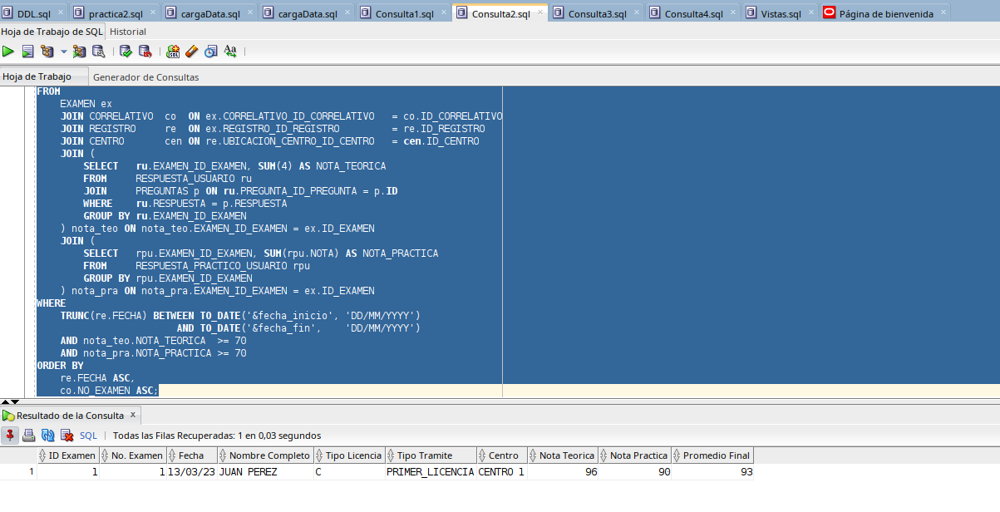
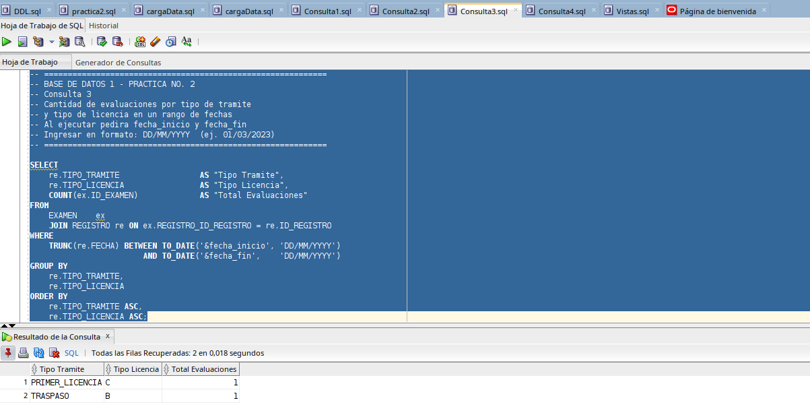
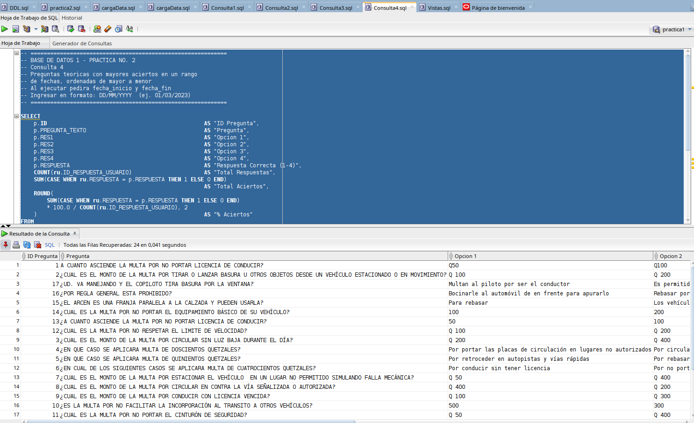

<div align="center">

#  Práctica No. 2 — Bases de Datos 1


**Universidad de San Carlos de Guatemala**  
Facultad de Ingeniería — Escuela de Ciencias y Sistemas  
Bases de Datos 1 | Carné: `202308204`

</div>

---

##  Tabla de Contenido

| # | Sección |
|---|---------|
| 1 | [Descripción General](#1-descripción-general) |
| 2 | [Modelo de Base de Datos Resultante](#2-modelo-de-base-de-datos-resultante) |
| 3 | [Modificaciones al Esquema (practica2.sql)](#3-modificaciones-al-esquema-practica2sql) |
| 4 | [Carga de Datos](#4-carga-de-datos) |
| 5 | [Consultas SQL](#5-consultas-sql) |

---
## 1. Descripción General

> Esta práctica consiste en **modificar la base de datos** generada en la Práctica 1, adaptándola a un nuevo modelo que representa el sistema de **evaluaciones de manejo** del Departamento de Tránsito de Guatemala.

Los objetivos principales son:

-  Eliminar tablas obsoletas y reemplazarlas por nuevas con estructura optimizada.
-  Renombrar tablas y columnas para que coincidan con el modelo actualizado.
-  Crear 8 nuevas tablas con sus relaciones y restricciones.
-  Poblar la base de datos con datos de prueba.
-  Crear **12 vistas** para facilitar la consulta del modelo.
-  Implementar **4 consultas analíticas** sobre el sistema de evaluaciones.

---

## 2. Modelo de Base de Datos Resultante

El esquema final contiene **12 tablas** distribuidas de la siguiente forma:

###  Tablas Conservadas y Modificadas

| Tabla actual | Era | Cambios aplicados |
|---|---|---|
| `DEPARTAMENTO` | `DEPTO` | Renombrada + columna `CODIGO` agregada |
| `MUNICIPIO` | `MUNICIPIO` | Columna FK renombrada + columna `CODIGO` |
| `CENTRO` | `CENTRO` | Eliminadas columnas `DIRECCION`, `FEC_CREACION`, `ID_USUARIO_REG` |
| `ESCUELA` | `ESCUELA` | `NUM_AUTORIZACION` → `ACUERDO`, columnas obsoletas eliminadas |

###  Tablas Nuevas Creadas

| Tabla | Reemplaza a | Propósito |
|---|---|---|
| `UBICACION` | `ESC_CENTRO` | Relación escuela–centro, PK compuesta |
| `PREGUNTAS` | `PREG_TEORICA` + `RESPUESTA` | Banco de preguntas teóricas con 4 opciones |
| `PREGUNTAS_PRACTICO` | `INSTR_PRACTICA` | Instrucciones de la prueba práctica con punteo |
| `REGISTRO` | `PERSONA` | Datos del evaluado por cada examen |
| `CORRELATIVO` | *(nueva)* | Control del número de examen diario |
| `EXAMEN` | `EVALUACION` | Examen vinculado a registro y correlativo |
| `RESPUESTA_USUARIO` | `EVAL_RESP` | Respuesta elegida (1–4) por pregunta teórica |
| `RESPUESTA_PRACTICO_USUARIO` | `EVAL_INSTR` | Nota obtenida por instrucción práctica |

###  Tablas Eliminadas

`USUARIO` · `INSTRUCTOR` · `PERSONA` · `PREG_TEORICA` · `RESPUESTA` · `INSTR_PRACTICA` · `EVALUACION` · `EVAL_RESP` · `EVAL_INSTR` · `ESC_CENTRO`

---

## 3. Modificaciones al Esquema (`practica2.sql`)

El script se ejecuta en **15 pasos ordenados** para respetar las dependencias de llaves foráneas.

### Paso 1 — Eliminar tablas dependientes obsoletas

```sql
DROP TABLE EVAL_INSTR     CASCADE CONSTRAINTS;
DROP TABLE EVAL_RESP      CASCADE CONSTRAINTS;
DROP TABLE EVALUACION     CASCADE CONSTRAINTS;
DROP TABLE RESPUESTA      CASCADE CONSTRAINTS;
DROP TABLE PREG_TEORICA   CASCADE CONSTRAINTS;
DROP TABLE INSTR_PRACTICA CASCADE CONSTRAINTS;
DROP TABLE PERSONA        CASCADE CONSTRAINTS;
DROP TABLE INSTRUCTOR     CASCADE CONSTRAINTS;
DROP TABLE ESC_CENTRO     CASCADE CONSTRAINTS;
```

### Paso 2–3 — Eliminar tabla `USUARIO`

```sql
-- Primero se quitan las FK que apuntaban a USUARIO
ALTER TABLE CENTRO  DROP CONSTRAINT FK_CEN_USUARIO;
ALTER TABLE ESCUELA DROP CONSTRAINT FK_ESC_USUARIO;

DROP TABLE USUARIO CASCADE CONSTRAINTS;
```

### Paso 4 — Modificar `CENTRO`

```sql
ALTER TABLE CENTRO DROP COLUMN DIRECCION;
ALTER TABLE CENTRO DROP COLUMN FEC_CREACION;
ALTER TABLE CENTRO DROP COLUMN ID_USUARIO_REG;
```

### Paso 5 — Modificar `ESCUELA`

```sql
ALTER TABLE ESCUELA DROP CONSTRAINT UQ_ESC_AUTORI;
ALTER TABLE ESCUELA RENAME COLUMN NUM_AUTORIZACION TO ACUERDO;
ALTER TABLE ESCUELA DROP COLUMN FEC_CREACION;
ALTER TABLE ESCUELA DROP COLUMN ID_USUARIO_REG;
```

### Paso 6 — Renombrar `DEPTO` → `DEPARTAMENTO`

```sql
RENAME DEPTO TO DEPARTAMENTO;
ALTER TABLE DEPARTAMENTO RENAME COLUMN ID_DEPTO TO ID_DEPARTAMENTO;
ALTER TABLE DEPARTAMENTO DROP COLUMN CALIFICACION1;
ALTER TABLE DEPARTAMENTO ADD CODIGO NUMBER(5);
```

### Paso 7 — Modificar `MUNICIPIO`

```sql
ALTER TABLE MUNICIPIO DROP CONSTRAINT FK_MUN_DEPTO;
ALTER TABLE MUNICIPIO RENAME COLUMN ID_DEPTO TO DEPARTAMENTO_ID_DEPARTAMENTO;
ALTER TABLE MUNICIPIO ADD CODIGO NUMBER(5);
ALTER TABLE MUNICIPIO ADD CONSTRAINT FK_MUN_DEPTO
    FOREIGN KEY (DEPARTAMENTO_ID_DEPARTAMENTO)
    REFERENCES DEPARTAMENTO (ID_DEPARTAMENTO);
```

### Pasos 8–15 — Creación de nuevas tablas

#### `PREGUNTAS`

```sql
CREATE TABLE PREGUNTAS (
    ID              NUMBER(10)    NOT NULL,
    PREGUNTA_TEXTO  VARCHAR2(500) NOT NULL,
    RESPUESTA       NUMBER(1)     NOT NULL,   -- 1 a 4: indica la opción correcta
    RES1            VARCHAR2(300) NOT NULL,
    RES2            VARCHAR2(300) NOT NULL,
    RES3            VARCHAR2(300) NOT NULL,
    RES4            VARCHAR2(300) NOT NULL,
    CONSTRAINT PK_PREGUNTAS PRIMARY KEY (ID),
    CONSTRAINT CK_PREG_RESP CHECK (RESPUESTA BETWEEN 1 AND 4)
);
```

#### `PREGUNTAS_PRACTICO`

```sql
CREATE TABLE PREGUNTAS_PRACTICO (
    ID_PREGUNTA_PRACTICO NUMBER(10)    NOT NULL,
    PREGUNTA_TEXTO       VARCHAR2(300) NOT NULL,
    PUNTEO               NUMBER(5,2)   NOT NULL,
    CONSTRAINT PK_PREG_PRACTICO PRIMARY KEY (ID_PREGUNTA_PRACTICO)
);
```

#### `UBICACION`

```sql
CREATE TABLE UBICACION (
    ESCUELA_ID_ESCUELA NUMBER(10) NOT NULL,
    CENTRO_ID_CENTRO   NUMBER(10) NOT NULL,
    CONSTRAINT PK_UBICACION   PRIMARY KEY (ESCUELA_ID_ESCUELA, CENTRO_ID_CENTRO),
    CONSTRAINT FK_UBI_ESCUELA FOREIGN KEY (ESCUELA_ID_ESCUELA) REFERENCES ESCUELA(ID_ESCUELA),
    CONSTRAINT FK_UBI_CENTRO  FOREIGN KEY (CENTRO_ID_CENTRO)   REFERENCES CENTRO(ID_CENTRO)
);
```

#### `REGISTRO`

```sql
CREATE TABLE REGISTRO (
    ID_REGISTRO                             NUMBER(10)    NOT NULL,
    UBICACION_ESCUELA_ID_ESCUELA            NUMBER(10)    NOT NULL,
    UBICACION_CENTRO_ID_CENTRO              NUMBER(10)    NOT NULL,
    MUNICIPIO_ID_MUNICIPIO                  NUMBER(10)    NOT NULL,
    MUNICIPIO_DEPARTAMENTO_ID_DEPARTAMENTO  NUMBER(10)    NOT NULL,
    FECHA                                   DATE          NOT NULL,
    TIPO_TRAMITE                            VARCHAR2(30)  NOT NULL,
    TIPO_LICENCIA                           VARCHAR2(5)   NOT NULL,
    NOMBRE_COMPLETO                         VARCHAR2(200) NOT NULL,
    GENERO                                  CHAR(1)       NOT NULL,
    CONSTRAINT PK_REGISTRO      PRIMARY KEY (ID_REGISTRO),
    CONSTRAINT FK_REG_ESCUELA   FOREIGN KEY (UBICACION_ESCUELA_ID_ESCUELA)
        REFERENCES ESCUELA(ID_ESCUELA),
    CONSTRAINT FK_REG_CENTRO    FOREIGN KEY (UBICACION_CENTRO_ID_CENTRO)
        REFERENCES CENTRO(ID_CENTRO),
    CONSTRAINT FK_REG_MUNICIPIO FOREIGN KEY (MUNICIPIO_ID_MUNICIPIO)
        REFERENCES MUNICIPIO(ID_MUNICIPIO),
    CONSTRAINT FK_REG_DEPTO     FOREIGN KEY (MUNICIPIO_DEPARTAMENTO_ID_DEPARTAMENTO)
        REFERENCES DEPARTAMENTO(ID_DEPARTAMENTO),
    CONSTRAINT CK_REG_GENERO    CHECK (GENERO IN ('M','F'))
);
```

#### `CORRELATIVO`

```sql
CREATE TABLE CORRELATIVO (
    ID_CORRELATIVO NUMBER(10) NOT NULL,
    FECHA          DATE       NOT NULL,
    NO_EXAMEN      NUMBER(5)  NOT NULL,
    CONSTRAINT PK_CORRELATIVO PRIMARY KEY (ID_CORRELATIVO)
);
```

#### `EXAMEN`

```sql
CREATE TABLE EXAMEN (
    ID_EXAMEN                                       NUMBER(10) NOT NULL,
    REGISTRO_ID_ESCUELA                             NUMBER(10) NOT NULL,
    REGISTRO_ID_CENTRO                              NUMBER(10) NOT NULL,
    REGISTRO_MUNICIPIO_ID_MUNICIPIO                 NUMBER(10) NOT NULL,
    REGISTRO_MUNICIPIO_DEPARTAMENTO_ID_DEPARTAMENTO NUMBER(10) NOT NULL,
    REGISTRO_ID_REGISTRO                            NUMBER(10) NOT NULL,
    CORRELATIVO_ID_CORRELATIVO                      NUMBER(10) NOT NULL,
    CONSTRAINT PK_EXAMEN          PRIMARY KEY (ID_EXAMEN),
    CONSTRAINT FK_EXA_REGISTRO    FOREIGN KEY (REGISTRO_ID_REGISTRO)
        REFERENCES REGISTRO(ID_REGISTRO),
    CONSTRAINT FK_EXA_CORRELATIVO FOREIGN KEY (CORRELATIVO_ID_CORRELATIVO)
        REFERENCES CORRELATIVO(ID_CORRELATIVO)
);
```

#### `RESPUESTA_USUARIO`

```sql
CREATE TABLE RESPUESTA_USUARIO (
    ID_RESPUESTA_USUARIO NUMBER(10) NOT NULL,
    PREGUNTA_ID_PREGUNTA NUMBER(10) NOT NULL,
    EXAMEN_ID_EXAMEN     NUMBER(10) NOT NULL,
    RESPUESTA            NUMBER(1)  NOT NULL,
    CONSTRAINT PK_RESP_USUARIO   PRIMARY KEY (ID_RESPUESTA_USUARIO),
    CONSTRAINT UQ_RU_PREG_EXAMEN UNIQUE (EXAMEN_ID_EXAMEN, PREGUNTA_ID_PREGUNTA),
    CONSTRAINT FK_RU_PREGUNTA    FOREIGN KEY (PREGUNTA_ID_PREGUNTA) REFERENCES PREGUNTAS(ID),
    CONSTRAINT FK_RU_EXAMEN      FOREIGN KEY (EXAMEN_ID_EXAMEN)     REFERENCES EXAMEN(ID_EXAMEN),
    CONSTRAINT CK_RU_RESPUESTA   CHECK (RESPUESTA BETWEEN 1 AND 4)
);
```

#### `RESPUESTA_PRACTICO_USUARIO`

```sql
CREATE TABLE RESPUESTA_PRACTICO_USUARIO (
    ID_RESPUESTA_PRACTICO                   NUMBER(10)  NOT NULL,
    PREGUNTA_PRACTICO_ID_PREGUNTA_PRACTICO  NUMBER(10)  NOT NULL,
    EXAMEN_ID_EXAMEN                        NUMBER(10)  NOT NULL,
    NOTA                                    NUMBER(5,2) NOT NULL,
    CONSTRAINT PK_RESP_PRACTICO    PRIMARY KEY (ID_RESPUESTA_PRACTICO),
    CONSTRAINT UQ_RP_PREG_EXAMEN   UNIQUE (EXAMEN_ID_EXAMEN, PREGUNTA_PRACTICO_ID_PREGUNTA_PRACTICO),
    CONSTRAINT FK_RP_PREG_PRACTICO FOREIGN KEY (PREGUNTA_PRACTICO_ID_PREGUNTA_PRACTICO)
        REFERENCES PREGUNTAS_PRACTICO(ID_PREGUNTA_PRACTICO),
    CONSTRAINT FK_RP_EXAMEN        FOREIGN KEY (EXAMEN_ID_EXAMEN) REFERENCES EXAMEN(ID_EXAMEN)
);
```

---

## 4. Carga de Datos

El script `cargaData.sql` inserta datos de prueba en todas las tablas del modelo. A continuación se muestra una muestra representativa:

### Departamentos (22 registros)

```sql
INSERT INTO DEPARTAMENTO (ID_DEPARTAMENTO, NOMBRE, CODIGO) VALUES (1, 'GUATEMALA',       1);
INSERT INTO DEPARTAMENTO (ID_DEPARTAMENTO, NOMBRE, CODIGO) VALUES (2, 'EL PROGRESO',     2);
INSERT INTO DEPARTAMENTO (ID_DEPARTAMENTO, NOMBRE, CODIGO) VALUES (3, 'SACATEPEQUEZ',    3);
-- ... hasta el departamento 22 (JUTIAPA)
```

### Municipios, Centros, Escuelas, Registros, Exámenes, Respuestas…

La carga sigue el orden correcto respetando las **llaves foráneas**:

```
DEPARTAMENTO → MUNICIPIO → ESCUELA / CENTRO → UBICACION
→ REGISTRO → CORRELATIVO → EXAMEN
→ RESPUESTA_USUARIO / RESPUESTA_PRACTICO_USUARIO
```

### Resultado de la carga


> Al finalizar se ejecuta `COMMIT` para confirmar todos los inserts o `ROLLBACK` en caso de error.

---

## 5. Consultas SQL

###  Consulta 1 — Evaluaciones realizadas en el día

**Archivo:** `Consulta1.sql`

> Lista de **todas las evaluaciones realizadas en una fecha específica**, con número de examen, datos del evaluado, escuela, centro, notas teórica y práctica, y estado final (APROBADO / REPROBADO).

**Parámetro requerido:** `fecha_consulta` en formato `DD/MM/YYYY`

```sql
SELECT
    co.NO_EXAMEN            AS "No. Examen",
    re.NOMBRE_COMPLETO      AS "Nombre Completo",
    re.TIPO_LICENCIA        AS "Tipo Licencia",
    re.TIPO_TRAMITE         AS "Tipo Tramite",
    d.NOMBRE                AS "Departamento",
    m.NOMBRE                AS "Municipio",
    esc.NOMBRE              AS "Escuela",
    cen.NOMBRE              AS "Centro",
    NVL((SELECT SUM(4)
         FROM RESPUESTA_USUARIO ru
         JOIN PREGUNTAS p ON ru.PREGUNTA_ID_PREGUNTA = p.ID
         WHERE ru.EXAMEN_ID_EXAMEN = ex.ID_EXAMEN
           AND ru.RESPUESTA = p.RESPUESTA), 0)   AS "Nota Teorica",
    NVL((SELECT SUM(rpu.NOTA)
         FROM RESPUESTA_PRACTICO_USUARIO rpu
         WHERE rpu.EXAMEN_ID_EXAMEN = ex.ID_EXAMEN), 0)  AS "Nota Practica",
    CASE WHEN /* nota_teo >= 70 AND nota_pra >= 70 */
              ... THEN 'APROBADO' ELSE 'REPROBADO' END    AS "Resultado"
FROM EXAMEN ex
    JOIN CORRELATIVO  co  ON ex.CORRELATIVO_ID_CORRELATIVO   = co.ID_CORRELATIVO
    JOIN REGISTRO     re  ON ex.REGISTRO_ID_REGISTRO         = re.ID_REGISTRO
    JOIN MUNICIPIO    m   ON re.MUNICIPIO_ID_MUNICIPIO       = m.ID_MUNICIPIO
    JOIN DEPARTAMENTO d   ON m.DEPARTAMENTO_ID_DEPARTAMENTO  = d.ID_DEPARTAMENTO
    JOIN ESCUELA      esc ON re.UBICACION_ESCUELA_ID_ESCUELA = esc.ID_ESCUELA
    JOIN CENTRO       cen ON re.UBICACION_CENTRO_ID_CENTRO   = cen.ID_CENTRO
WHERE TRUNC(re.FECHA) = TO_DATE('&fecha_consulta', 'DD/MM/YYYY')
ORDER BY co.NO_EXAMEN ASC;
```

**Output generado en SQL Developer:**



**Resultado visual:**



---

###  Consulta 2 — Evaluaciones aprobadas en un rango de fechas

**Archivo:** `Consulta2.sql`

> Lista de evaluaciones donde **nota teórica ≥ 70 Y nota práctica ≥ 70**, en un rango de fechas ingresado por el usuario.

**Parámetros requeridos:** `fecha_inicio` y `fecha_fin` en formato `DD/MM/YYYY`

```sql
SELECT
    ex.ID_EXAMEN            AS "ID Examen",
    co.NO_EXAMEN            AS "No. Examen",
    re.FECHA                AS "Fecha",
    re.NOMBRE_COMPLETO      AS "Nombre Completo",
    re.TIPO_LICENCIA        AS "Tipo Licencia",
    re.TIPO_TRAMITE         AS "Tipo Tramite",
    cen.NOMBRE              AS "Centro",
    nota_teo.NOTA_TEORICA   AS "Nota Teorica",
    nota_pra.NOTA_PRACTICA  AS "Nota Practica",
    ROUND((nota_teo.NOTA_TEORICA + nota_pra.NOTA_PRACTICA) / 2, 2) AS "Promedio Final"
FROM EXAMEN ex
    JOIN CORRELATIVO co  ON ex.CORRELATIVO_ID_CORRELATIVO = co.ID_CORRELATIVO
    JOIN REGISTRO    re  ON ex.REGISTRO_ID_REGISTRO       = re.ID_REGISTRO
    JOIN CENTRO      cen ON re.UBICACION_CENTRO_ID_CENTRO = cen.ID_CENTRO
    JOIN (
        SELECT ru.EXAMEN_ID_EXAMEN, SUM(4) AS NOTA_TEORICA
        FROM   RESPUESTA_USUARIO ru
        JOIN   PREGUNTAS p ON ru.PREGUNTA_ID_PREGUNTA = p.ID
        WHERE  ru.RESPUESTA = p.RESPUESTA
        GROUP BY ru.EXAMEN_ID_EXAMEN
    ) nota_teo ON nota_teo.EXAMEN_ID_EXAMEN = ex.ID_EXAMEN
    JOIN (
        SELECT rpu.EXAMEN_ID_EXAMEN, SUM(rpu.NOTA) AS NOTA_PRACTICA
        FROM   RESPUESTA_PRACTICO_USUARIO rpu
        GROUP BY rpu.EXAMEN_ID_EXAMEN
    ) nota_pra ON nota_pra.EXAMEN_ID_EXAMEN = ex.ID_EXAMEN
WHERE TRUNC(re.FECHA) BETWEEN TO_DATE('&fecha_inicio','DD/MM/YYYY')
                          AND TO_DATE('&fecha_fin',   'DD/MM/YYYY')
  AND nota_teo.NOTA_TEORICA  >= 70
  AND nota_pra.NOTA_PRACTICA >= 70
ORDER BY re.FECHA ASC, co.NO_EXAMEN ASC;
```

**Resultado:**



---

###  Consulta 3 — Evaluaciones por tipo de trámite y licencia

**Archivo:** `Consulta3.sql`

> Conteo de evaluaciones agrupadas por **tipo de trámite** y **tipo de licencia** en un rango de fechas.

**Parámetros requeridos:** `fecha_inicio` y `fecha_fin` en formato `DD/MM/YYYY`

```sql
SELECT
    re.TIPO_TRAMITE        AS "Tipo Tramite",
    re.TIPO_LICENCIA       AS "Tipo Licencia",
    COUNT(ex.ID_EXAMEN)    AS "Total Evaluaciones"
FROM EXAMEN ex
    JOIN REGISTRO re ON ex.REGISTRO_ID_REGISTRO = re.ID_REGISTRO
WHERE TRUNC(re.FECHA) BETWEEN TO_DATE('&fecha_inicio','DD/MM/YYYY')
                          AND TO_DATE('&fecha_fin',   'DD/MM/YYYY')
GROUP BY re.TIPO_TRAMITE, re.TIPO_LICENCIA
ORDER BY re.TIPO_TRAMITE ASC, re.TIPO_LICENCIA ASC;
```

**Resultado:**



---

###  Consulta 4 — Preguntas teóricas con mayores aciertos

**Archivo:** `Consulta4.sql`

> Ranking de preguntas teóricas ordenadas de mayor a menor por **cantidad de aciertos** en un rango de fechas. Incluye porcentaje de aciertos.

**Parámetros requeridos:** `fecha_inicio` y `fecha_fin` en formato `DD/MM/YYYY`

```sql
SELECT
    p.ID                                                         AS "ID Pregunta",
    p.PREGUNTA_TEXTO                                             AS "Pregunta",
    p.RES1                                                       AS "Opcion 1",
    p.RES2                                                       AS "Opcion 2",
    p.RES3                                                       AS "Opcion 3",
    p.RES4                                                       AS "Opcion 4",
    p.RESPUESTA                                                  AS "Respuesta Correcta (1-4)",
    COUNT(ru.ID_RESPUESTA_USUARIO)                               AS "Total Respuestas",
    SUM(CASE WHEN ru.RESPUESTA = p.RESPUESTA THEN 1 ELSE 0 END) AS "Total Aciertos",
    ROUND(
        SUM(CASE WHEN ru.RESPUESTA = p.RESPUESTA THEN 1 ELSE 0 END)
        * 100.0 / COUNT(ru.ID_RESPUESTA_USUARIO), 2
    )                                                            AS "% Aciertos"
FROM PREGUNTAS p
    JOIN RESPUESTA_USUARIO ru ON ru.PREGUNTA_ID_PREGUNTA = p.ID
    JOIN EXAMEN            ex ON ru.EXAMEN_ID_EXAMEN     = ex.ID_EXAMEN
    JOIN REGISTRO          re ON ex.REGISTRO_ID_REGISTRO = re.ID_REGISTRO
WHERE TRUNC(re.FECHA) BETWEEN TO_DATE('&fecha_inicio','DD/MM/YYYY')
                          AND TO_DATE('&fecha_fin',   'DD/MM/YYYY')
GROUP BY p.ID, p.PREGUNTA_TEXTO, p.RES1, p.RES2, p.RES3, p.RES4, p.RESPUESTA
ORDER BY SUM(CASE WHEN ru.RESPUESTA = p.RESPUESTA THEN 1 ELSE 0 END) DESC;
```

**Resultado:**



---


